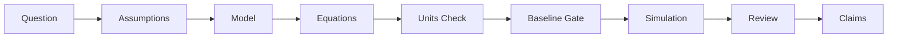

# Research Partner: AI 지원 물리학 연구 하네스

Research Partner는 AI 어시스턴트와 물리학 연구를 협력할 때 과학적 엄밀성을 보장하도록 설계된 원칙 중심(discipline-first)의 하네스(도구 환경)입니다. AI의 창의적인 속도와 물리적 발견에 요구되는 느리고 체계적인 규율 사이의 간극을 메워줍니다.

## 🚀 주요 기능

### 1. 과학적 무결성 체인

추론 과정을 절대 놓치지 마세요. Research Partner는 초기 물리적 질문부터 최종 논문 주장에 이르기까지 엄격하고 추적 가능한 경로를 강제합니다.



### 2. 자동화된 규율 게이트 (스킬)

모호한 지시 대신, 이 하네스는 연구를 위한 TDD(테스트 주도 개발)처럼 작동하는 **특화된 스킬**들을 사용합니다:

* **`model-specification`**: 변수, 도메인, 유효성 체제(validity regimes)에 대한 명시적인 정의를 강제합니다.
* **`dimensional-analysis`**: 시뮬레이션에 몇 시간을 낭비하기 전에 단위 불일치를 자동으로 찾아냅니다.
* **`baseline-validation`**: 실제 결과를 해석하기 전에 모델이 "토이 모델" 또는 "해석적 한계(analytical limit)" 테스트를 통과하도록 요구하는 필수 관문입니다.

### 3. 시각적 워크플로우 내비게이션

이 하네스는 활성 실행 전용 **Current Run Dashboard**(`<project>/ResearchPartner-runs/.../workflow_map.html`)를 생성합니다. 중앙 대시보드(`docs/workflow_map.html`)는 기본적으로 생성하지 않으며 `python scripts/generate_workflow_map.py --central`로 명시적으로 요청해야 만들어집니다. 실행 대시보드는 다음과 같은 정보를 실시간으로 제공합니다:

* 현재 어느 단계에 있는지.
* 통과한(또는 현재 막혀 있는) "게이트".
* 입력, 승인, 권장 검토 항목을 클릭해서 볼 수 있는 Action Queue.
* 연구자가 보는 것이 권장되는 문서, 관련 로그, 그림, 증거에 대한 직접 링크.
* Lucidchart 스타일의 **Lineage 탭**: Cytoscape.js + dagre(인터넷 불필요, `docs/vendor/`에 동봉)로 Papers → Decisions → Model Versions → Results → Claims 흐름을 한 화면에 시각화합니다. 엣지 색상은 관계(relation), 굵기는 `evidence_strength`, stale/broken 링크는 주황/빨강으로 표시됩니다. lineage_kind, claim ceiling, "review 대기만" 필터를 지원합니다. `python scripts/build_lineage_graph.py`가 `ResearchPartner-runs/_index/lineage_graph.json`을 생성하면 **Cross-Run Lineage** 탭이 추가로 나타나 `parent_run` / `evolved_from` / `reproduces` 관계로 여러 실행을 잇습니다. 실제 실행 전에 탭이 어떻게 보이는지 미리 보고 싶다면 빈 탭의 **Load demo lineage** 버튼을 누르거나, `python scripts/seed_lineage_demo.py` 후 `python scripts/build_lineage_graph.py`로 예시용 `_demo_lineage` 실행을 추가하세요.

  

  Lineage 노드는 artifact 파일의 `lineage:` YAML front-matter 블록에서 시드됩니다. 각 skill의 **Lineage Front-Matter** 섹션은 에이전트에게 이 블록(`cites_paper`, `evolved_from`, `reproduces`, `supports`, `limits` 등의 엣지 포함)을 추가하고 `/sync-workflow`를 실행하여 그래프를 재구성하도록 지시합니다. **Lineage Coverage Gate**(`python scripts/check_lineage_coverage.py --project <project-dir>`)는 에이전트가 그 단계를 건너뛴 경우 경고합니다 (supports 없는 claim, evolved_from 없는 비초기 model version, 고립된 paper 리뷰, limits 없는 미해결 anomaly). **Broken-Edge Linter**(`python scripts/sync_workflow.py --project <project-dir> --validate-edges`)는 Cytoscape가 조용히 무시할 graph_links 오타를 잡아냅니다.

---

## 🛠 설치 가이드

빠른 시작: 연구 프로젝트 루트 내에서 다음 명령어 하나로 설치하세요:

```powershell
python -c "import urllib.request; exec(urllib.request.urlopen('https://raw.githubusercontent.com/kisbi3/ResearchPartner/main/scripts/install.py').read())"

```

그런 다음 동일한 디렉토리에서 AI 코딩 또는 연구 에이전트를 열고 검증 중심의 작은 요청으로 시작하세요:

```text
Use the research-plan-review skill to help me define a small validation target.

```

설치 프로그램은 최신 Research Partner 하네스를 다운로드하여, 지침 파일, 스킬 라이브러리, 워크플로우 문서 및 헬퍼 스크립트를 현재 프로젝트 루트에 설치하며, 관련 없는 연구 파일은 건드리지 않습니다.

기존 하네스 설치를 업데이트하려면 `--force` 옵션을 추가하여 동일한 명령어를 다시 실행하세요:

```powershell
python -c "import urllib.request; exec(urllib.request.urlopen('https://raw.githubusercontent.com/kisbi3/ResearchPartner/main/scripts/install.py').read())" --force

```

### 얻을 수 있는 것

규율 있는 연구 루프를 한 번 거치고 나면, 느슨했던 물리적 아이디어가 추적 가능한 연구 상태로 변합니다. 즉, 가정이 기록되고, 단위가 확인되며, 베이스라인 목표가 식별되고, 실행 범위가 제한되며, 증거에 의해 주장이 뒷받침됩니다.

| 단계 | 이전 | 이후 |
| --- | --- | --- |
| 방향 설정 (Orient) | "이 모델 분석해 줘" | 작업을 모델 사양, 검증, 시뮬레이션, 그림 감사, 논문 주장, 이상 현상 디버깅 또는 도입 작업으로 분류 |
| 인터뷰 (Interview) | 숨겨진 가정 | 실행 전 물리적 객체, 관측값, 경계 조건, 근사 체제, 단위, 검토 체크포인트를 표면화 |
| 명세화 (Specify) | 안정적인 연구 계약 없음 | 가정, 검증 목표, 관측값, 실패 기준, 주장-증거 경로가 포함된 연구 계획 |
| 시드 (Seed) | 모호한 다음 행동 | 파일, 명령어, 입력, 출력, 통과/실패 기준, 실패 처리 등 테스트 설계 작업 체계화 |
| 검증 (Validate) | "그럴싸해 보임" | 베이스라인 게이트: 토이 모델, 알려진 한계, 재현 목표, 보존 검사, 차원 타당성 검사 또는 명시적 예외 처리 |
| 실행 (Execute) | 제한 없는 코딩 또는 플로팅 | 매개변수, 시드, 명령어, 출력 및 검증 상태를 보고하는 제한된 구현 |
| 평가 (Evaluate) | 해석이 출력 결과에서 벗어남 | 교수 주도의 검토를 통해 관찰, 해석, 추측, 근거 없는 주장을 분리 |
| 회고 (Retrospect) | 결과가 채팅창 속으로 사라짐 | 재사용 가능한 로그 항목, 부정적인 결과, 미해결 질문, 워크플로우 업데이트, 벤치마크 또는 결정 기록 |

무슨 일이 일어난 걸까요? 하네스는 코드를 작성하기 전에 연구 대상을 명시적으로 만들도록 강제했고, 해석에 들어가기 전에 증거 체인을 계속 볼 수 있도록 강제했습니다.

### 비교 분석

AI 코딩 도구는 강력하지만, 입력이 과학적으로 불충분하게 명세화되거나 주장이 증거를 넘어서면 물리학 연구는 실패합니다.

| 주제 | 기본 AI 코딩 | Research Partner |
| --- | --- | --- |
| 모호한 프롬프트 | AI가 의도를 추측하고 물리적 가정을 말없이 채워 넣음 | 실행 전 소크라테스식 인터뷰로 가정을 드러냄 |
| 단위 및 체제 | 단위 변환, 무차원화 및 근사가 눈에 띄지 않게 틀어질 수 있음 | 가정, 단위 변환 및 근사 체제 후크가 모델의 도메인을 기록함 |
| 베이스라인 검증 | 시뮬레이션이 그저 실행되기만 해도 해석될 수 있음 | 토이 모델, 알려진 한계, 재현 또는 예외 처리가 존재할 때까지 해석을 차단하는 베이스라인 게이트 |
| 수치 작업 | 타임스텝, 그리드, 허용 오차, 시드, 스윕 변경 등이 코드에 묻힐 수 있음 | 매개변수, 안정성, 수렴, 불확실성, 재현성 후크를 통해 실행 메타데이터를 볼 수 있게 유지 |
| 그림 | 출처 없이 플롯이 주장이 될 수 있음 | 스크립트, 명령어, 데이터, 매개변수, 출력 경로, 캡션 주장을 연결하는 그림 출처 기록 |
| 논문 주장 | 편집 중 언어 표현이 종종 과장됨 | 주장 강도 및 논문 표류(drift) 후크가 근거 없는 표현을 통제함 |
| 이상 현상 | 증상부터 패치됨 | 수정 전 예상 동작과 관찰된 동작을 분류하는 이상 현상 후크 |
| 검토 | 수동적인 "좋아 보임" 검토 | 교수 주도의 평가와 연구자 체크포인트, 가시적인 워크플로우 상태 제공 |

### 루프

Research Partner는 장식용 워크플로우 차트가 아닙니다. 이 루프 자체가 연구 방법론입니다:

```text
Orient -> Interview -> Specify -> Seed -> Validate -> Execute -> Evaluate -> Review -> Retrospect
    ^                                                                                           |
    +----------------------------- Evolutionary Loop ---------------------------------+

```

각 주기는 연구 상태를 변화시켜야 합니다. 더 강력한 검증 게이트, 더 명확한 가정, 기각된 가설, 더 깔끔한 그림 계통, 더 낮아진 주장의 상한선, 혹은 더 나은 다음 질문을 만들어냅니다. 평가의 출력 결과는 다음 명세화의 입력이 됩니다.

| 단계 | 진행 내용 |
| --- | --- |
| 방향 설정 (Orient) | 작업 분류 및 책임 연구 역할 식별 |
| 인터뷰 (Interview) | 첫 번째 교수 수준의 질문을 던지고 모호성을 드러냄 |
| 명세화 (Specify) | 모델의 의미, 가정, 단위, 관측값, 실패 기준 기록 |
| 시드 (Seed) | 연구의 씨앗을 테스트 가능한 에이전트 작업으로 변환 |
| 검증 (Validate) | 베이스라인, 수치적 안정성, 단위, 데이터 계통 또는 재현 목표 확인 |
| 실행 (Execute) | 제한된 코딩, 분석, 플로팅 또는 문헌 처리 작업 실행 |
| 평가 (Evaluate) | 뒷받침되는 관찰 결과를 해석 및 추측과 분리 |
| 검토 (Review) | 증거, 그림, 오래된 아티팩트, 예외 사항 및 체크포인트를 연구자에게 제시 |
| 회고 (Retrospect) | 결과, 부정적 결과, 미해결 질문 및 재사용 가능한 검사 항목 보존 |

수렴(Convergence)은 "코드가 실행되었다"는 것을 의미하지 않습니다. 수렴이란 현재의 주장이 현재의 증거 체인보다 결코 강하지 않음을 의미합니다.

### 명령어

설치된 프로젝트 루트에서 이 명령어들을 사용하세요. 대화 중에 어시스턴트가 일치하는 스킬과 워크플로우 후크를 호출해야 합니다. 터미널 명령어는 지속 가능한 아티팩트를 생성하거나 검증합니다.

| 필요 | 명령어 | 역할 |
| --- | --- | --- |
| 하네스 설치 | `python -c "import urllib.request; exec(urllib.request.urlopen('https://raw.githubusercontent.com/kisbi3/ResearchPartner/main/scripts/install.py').read())"` | 지침, 스킬, 문서, 스크립트를 현재 프로젝트에 설치 |
| 하네스 새로고침 | 위 설치 명령어에 `--force` 추가 | 관리되는 하네스 파일을 의도적으로 덮어씀 |
| 실행 시작 | `python scripts\start_research_run.py --name "topic name"` | 프로젝트 안의 `ResearchPartner-runs\` 루트 아래에 날짜가 지정된 실행 패킷 생성 (`--runs-root`로 변경 가능), `docs\process\live_workflow_diagram.md` 포함 |
| 기존 프로젝트 감사 | `python scripts\audit_existing_project.py` | 레트로핏 전 스크립트, 그림, 출력, 검증 누락 항목의 인벤토리 작성 |
| 슬래시 명령어 설치 | `python scripts\install_skills.py` | 연구자용 스킬 7개를 `.claude/commands/`, `.agents/workflows/`, `.codex/skills/`에 복사해 Claude Code, Antigravity CLI, Codex CLI에서 `/task-intake`, `/meeting` 등으로 사용 가능하게 합니다. SKILL.md 수정 후 재실행 필요. |
| 슬래시 명령어 전역 설치 | `python scripts\install_skills.py --global` | 위와 동일하지만 `~/.claude/commands/`, `~/.gemini/antigravity/global_workflows/`, `~/.codex/skills/`에 설치해 모든 프로젝트에서 사용 가능합니다. |
| 하네스 평가 | `python scripts\evaluate_harness.py` | 올바른 스킬, 게이트 및 차단된 동작에 대한 현실적인 시나리오 확인 |
| CI 하네스 검사 | `.github/workflows/harness-checks.yml` | push와 pull request에서 pytest, manifest, spawn-contract, contract-sync, evaluator repo-state checker를 실행; live Claude Code hook 발화를 대체하지 않음 |
| capability manifest 검증 | `python scripts\check_harness_manifest.py --project <project-dir>` | canonical capability, hook registry coverage, `$CLAUDE_PROJECT_DIR` hook 경로, 실제 `workflow_gate_keys` 정합성 확인 |
| spawn contract 검증 | `python scripts\check_spawn_contracts.py --project <project-dir>` | leaf `.claude/agents/<role>.md`, 역할별 `tools:`, `subagent_type` 이름, nested spawn 부재, 명시-spawn-only description 정합성 확인 |
| 링크 검증 | `python scripts\validate_workflow_links.py` | 워크플로우 문서 링크 확인 |
| 워크플로우 맵 생성 | `python scripts\generate_workflow_map.py` | 최신 실행의 `workflow_map.html` 및 `workflow_map.json`을 새로고침. 중앙 `docs\workflow_map.html`은 `--central` 옵션을 명시할 때만 빌드 |
| 논문 로직 포함 | `python scripts\generate_workflow_map.py --include-paper-logic` | 논문 계획이 명시적으로 시작될 때 논문 로직 뷰 추가 |
| 논문 리뷰 스캐폴딩 | `python scripts\scaffold_paper_review.py --run <run-dir> --paper-id P1 --title "Title"` | 재사용 가능한 논문 리뷰 노트를 생성하고 문헌 인덱스 업데이트 |
| 논문 PDF 처리 | `python scripts\process_paper_for_review.py --run <run-dir> --paper-id P1 --title "Title" --pdf <pdf-path>` | 리뷰 스캐폴딩, 텍스트 추출, 임시 추출 노트 초안 작성 |
| 논문 리뷰 확인 | `python scripts\check_paper_review_quality.py <review-path>` | 약한 논문 노트가 참신성이나 재현 주장의 근거가 되기 전에 차단 |
| 계약 동기화 검증 | `python scripts\check_contract_sync.py` | `AGENTS.md`와 `GEMINI.md`가 바이트 단위로 동일하도록 강제하여 두 런타임이 같은 계약을 따르게 보장 |
| Orient 게이트 검증 | `python scripts\check_orient_recorded.py --run <run-dir>` | `docs/gates/orient_note.md`에 task-intake 산출물(분류, 역할, 첫 질문, 연구자 답변)이 기록되지 않으면 Seed, Execute, Evaluate 작업 차단 |
| Interview 게이트 검증 | `python scripts\check_interview_recorded.py --run <run-dir>` | `docs/gates/interview_notes.md`에 professor-interview 산출물(결정화된 연구 질문, 가정, 합의된 방향)이 기록되지 않으면 Seed, Execute 작업 차단 |
| Literature 게이트 검증 | `python scripts\check_literature_reviewed.py --run <run-dir>` | `docs/literature/literature_review_plan.md`에 `## Literature Gate Status: ready/waived`가 없거나 `docs/literature/literature_skip_waiver.md`가 없으면 model-specification 또는 seed-design 차단 (스킵 시 claim ceiling → `interpretation`) |
| Model 게이트 검증 | `python scripts\check_model_specified.py --run <run-dir>` | `docs/plan/model_spec.md`에 물리 시스템과 지배 방정식이 없거나 `docs/plan/model_skip_waiver.md`가 없으면 seed-design 또는 execute 차단 (스킵 시 claim ceiling → `observation`) |
| Baseline Strategy 게이트 검증 | `python scripts\check_baseline_strategy.py --run <run-dir>` | `docs/plan/baseline_strategy.md`에 교수-대학원생 대화 결정(`variation` 또는 `new model`)과 정량적 검증 타겟이 없으면 seed-design 차단. 스킵 불가. |
| Baseline 게이트 검증 | `python scripts\check_baseline_gate.py --run <run-dir>` | `baseline_registry.md`에 `pass` 항목이 없거나, `waived` 항목이 있어도 라이브 워크플로의 claim ceiling이 `observation`으로 강등되지 않으면 후속 작업 차단 |
| Claim promotion 검증 | `python scripts\check_claim_promotion.py --project <project-dir> --target mechanism` | mechanism/generalization 승격 시 validation count/diversity와 `docs/claims/<claim_id>.md`의 Finding Lifecycle, `Evidence Paths Read Directly`를 함께 검사 |
| Figure provenance 검증 | `python scripts\check_figure_provenance.py --root <run-dir>` | 모든 figure 파일에 형제 `*.provenance.md` 또는 `figure_provenance.md`의 매칭 엔트리가 없으면 실패 |
| 세션 재개 가능성 검증 | `python scripts\check_session_resumable.py` | usage limit 등으로 세션이 끊겼다가 재시작될 때, 라이브 워크플로 다이어그램의 `spawned` 상태 in-flight 서브에이전트 작업과 `blocked`/`in_progress` 게이트를 나열해 다음 세션을 이어가기 전 연구자가 처리해야 할 항목을 알려줌. 최신 실행을 자동 탐색하며 `--run <run-dir>`로 특정 실행 지정, `--json`으로 기계 판독 출력 가능 |
| 연산 체크포인트 확인 | `python scripts\check_computation_resumable.py --run <run-dir>` | 중단된 장기 실행 스크립트가 남긴 `cache/checkpoint_*.pkl` 파일 목록 표시. 매칭되는 로그 파일이 없는 체크포인트는 orphaned(고아) 상태로 표시되며, src/ 스크립트에서 `CheckpointManager.load()`로 재개하거나 `--clear <stem>`으로 삭제 가능 |

### 리서치 마인드 (연구 페르소나)

실질적인 작업을 위해 이 하네스는 단순한 단일 코드 생성기가 아니라 교수 주도의 연구 그룹처럼 행동합니다.

| 에이전트 스탠스 | 역할 | 핵심 질문 |
| --- | --- | --- |
| 소크라테스식 면접관 | 질문만 함. 절대 먼저 구축하지 않음. | "무엇을 가정하고 있습니까?" |
| 존재론자 | 증상이 아닌 본질을 찾음. | "이것의 진짜 정체는 무엇입니까?" |
| 시드 설계자 | 대화를 통해 사양을 구체화함. | "이것이 완전하고 모호하지 않습니까?" |
| 평가자 | 단계별 검증 수행. | "우리가 올바른 것을 만들었습니까?" |
| 반대자 | 모든 가정에 의문을 제기함. | "만약 그 반대가 사실이라면 어떨까요?" |
| 해커 | 파격적인 경로를 찾음. | "실제로 존재하는 제약 조건은 무엇입니까?" |
| 단순화자 | 복잡성을 제거함. | "작동할 수 있는 가장 단순한 형태는 무엇입니까?" |
| 연구자 | 코딩을 멈추고 조사를 시작함. | "우리에게 실제로 있는 증거는 무엇입니까?" |
| 아키텍트 | 구조적 원인을 파악함. | "우리가 처음부터 다시 시작한다면, 이런 방식으로 구축했을까요?" |

이러한 스탠스들은 single-spawner 운영 모델을 지원합니다. Lead Agent(메인 대화 컨텍스트, *spawn되는 별도 subagent가 아님*)는 과학적 판단, 주장 규율, 모든 `Agent()` spawn을 담당합니다. Graduate Student는 spawn되는 별도 tier가 아니라 Lead가 seed task마다 로드하는 역할입니다. 피어 리뷰 교수(Peer-Review Professor)는 `meeting --scope review` 세션에서만 spawn되는 외부 대립 검토자입니다. leaf 코딩 하위 에이전트(Coding Subagents)는 Lead의 검증 전략이 명확해진 후에만 제한된 구현/검증/audit를 실행합니다. 워크플로우 상태는 `scripts/workflow_hooks.py`(Agent() spawn 자동 추적)와 `/sync-workflow` 스킬(게이트 완료 후 온디맨드 파일시스템 워크)로 관리됩니다.

큰 작업에서는 Lead Agent가 유일한 spawner입니다. Graduate Student agent를 spawn하지 않고, `skills/graduate-student/SKILL.md`를 seed task 하나에 대한 Lead 역할로 로드합니다. Lead가 직접 leaf agent인 **Implementation Agent**, **Scientific Validator**, **Cache-Log Auditor**, **Peer-Review Professor**를 spawn합니다. 역할 agent 정의는 `.claude/agents/<role>.md`에 있고, `docs/harness/spawn_contracts.json`이 leaf agent 정의, `tools:` frontmatter, skill 선언, `subagent_type` 이름의 정합성을 유지합니다. task orchestration template, leaf spawn block, cross-tier 금지 규칙은 `docs/orchestration_protocol.md`의 "Agent Spawning Protocol" 섹션을 참조하세요.

### 설치되는 Skills

설치 스크립트는 다음 skill들을 대상 프로젝트의 `skills/` 디렉터리에 복사합니다. 에이전트는 README를 전체 운영 매뉴얼처럼 외우는 것이 아니라, 필요한 시점에 해당 skill을 로드해야 합니다.

| Skill | 언제 쓰는가 |
| --- | --- |
| `task-intake` | 모든 연구 작업의 시작 시점 — 작업 유형을 분류하고, 연구 역할을 배정하고, 실행 전에 교수의 첫 질문을 꺼낸다 (Orient 단계) |
| `research-plan-review` | 큰 시뮬레이션, 분석 workflow, figure set, reproduction, manuscript claim 전략을 실행하기 전 |
| `model-specification` | 물리 모델, 변수, 방정식, 가정, 파라미터, 제약, validity regime을 정의하거나 검토할 때 |
| `dimensional-analysis` | 방정식, 물리 파라미터, 단위, scaling law, 무차원화, dimensionless group이 등장할 때 |
| `baseline-validation` | 새 모델, solver, 분석 pipeline, figure workflow, 해석에 toy model, known limit, benchmark, reproduction check가 필요할 때 |
| `seed-design` | 승인된 연구 계획을 파일, 명령어, 입력, 출력, 통과/실패 기준, 실패 처리가 포함된 대학원생 에이전트 작업으로 변환할 때 (Seed 단계) |
| `numerical-validation` | simulation, numerical solver, convergence, stability, computational validation을 실행, 수정, 해석할 때 |
| `claim-to-evidence` | 초록, 서론, 결과, 토론, 결론, caption, 원고 문장 등 claim과 evidence를 연결해야 할 때 |
| `scientific-verification-before-claim` | 방정식, simulation, figure, data, citation에 의존하는 주장을 만들거나 강화하기 전 |
| `anomaly-debugging` | 결과, simulation, plot, fit, derivation, unit check, conservation law, reproduction이 예상과 다를 때 |
| `researcher-review-loop` | 중간 결과를 보여주고 다음 행동을 결정하거나 연구자 결정을 기록할 때 |
| `sync-workflow` | 라이브 워크플로우 상태 업데이트 — 파일시스템 워크로 게이트 상태와 lineage 그래프를 재구성. 게이트 완료, 스테이지 완료, 또는 artifact 파일에 `lineage:` front-matter 추가 후 실행 |
| `research-retrospective` | iteration, validation run, reproduction, anomaly investigation, figure audit, manuscript revision이 끝났을 때 |
| `existing-research-onboarding` | 이미 code, data, figure, simulation, note, result, manuscript claim이 있는 프로젝트에 하네스를 붙일 때 |
| `literature-review-planning` | novelty, prior methods, reproduction target, 연구자 제공 PDF가 연구 방향을 바꿀 수 있을 때 |
| `baseline-strategy` | model-specification 이후 — 교수-대학원생 대화로 variation vs. new model을 결정하고 seed-design 전에 첫 검증 타겟을 고정할 때 |
| `meeting` | "이게 말이 되는가?"를 외부 관점으로 검증할 때 — `--scope quick/review/full`, `--on "<질문>"` 파라미터로 소집. 워크플로의 어느 시점에서도 호출 가능. |
| `peer-review-professor` | `meeting` 세션 안에서 활성화되는 외부 대립 검토자 역할 — 프로젝트 히스토리 없이 5가지 스탠스로 주장의 허점을 찾음 |
| `graduate-student` | Lead Agent가 seed task 하나를 조율할 때 로드함 — task 전략, Lead 코드 리뷰, leaf-agent 조율, 이상 감지 에스컬레이션, evidence 기록을 담당 |
| `implementation-agent` | spawn된 Implementation Agent가 로드함 — `src/`에 코드 작성만 담당; 코드 실행이나 결과 판단, 물리 해석은 하지 않음 |
| `scientific-validator` | spawn된 Scientific Validator가 로드함 — `run_with_capture.py`로 스크립트를 실행하고 사전 정의된 pass/fail 기준을 기계적으로 적용; 코드 수정이나 claim 강화는 금지 |
| `cache-log-auditor` | spawn된 Cache-Log Auditor가 로드함 (Scientific Validator 직후 항상 spawn) — `audit_run_outputs.py`로 `logs/`, `errors/`, `cache/`에 충분한 산출물이 남았는지 검증 |
| `harness-evaluation` | 하네스 자체가 실제 연구 시나리오에서 잘 작동하는지 평가할 때 |

### 1. 전제 조건

* 하네스가 실행될 로컬 연구 프로젝트 디렉토리 (예: `C:\MyPhysicsProject`).
* 터미널에서 `python`으로 실행 가능한 Python 3.10 이상. 내장된 헬퍼 스크립트는 Python 표준 라이브러리만 사용하므로 하네스 자체를 위한 `pip install` 단계는 필요하지 않습니다.
* 리포지토리 지침을 읽는 AI 어시스턴트:
* **Codex / Copilot 스타일 에이전트**는 `AGENTS.md`를 읽습니다.
* **Gemini CLI**는 `GEMINI.md`를 읽습니다.
* **Claude Code**는 `AGENTS.md`를 사용하거나 프로젝트 전용 `CLAUDE.md`를 추가할 수 있습니다.

* Git은 필수는 아니지만 권장됩니다. 검증을 마친 후 어시스턴트가 일관된 하네스나 연구 마일스톤을 체크포인트로 남길 수 있게 해줍니다.

### 2. 프로젝트 루트에 설치

과학적 워크플로우를 보호하고자 하는 프로젝트의 루트에 Research Partner를 설치하세요. 프로젝트 루트는 연구 코드, 데이터 노트, 그림, 논문 자료가 있거나 있을 디렉토리입니다.

새 프로젝트의 경우:

```powershell
mkdir C:\MyPhysicsProject
cd C:\MyPhysicsProject

```

기존 프로젝트의 경우:

```powershell
cd C:\ExistingPhysicsProject

```

실행(run) 출력 결과를 하네스 소스 리포지토리에 다시 설치하지 마세요. 실행별 증거는 `<project-root>\ResearchPartner-runs\YYYY-MM-DD-topic-name\`처럼 프로젝트 안에 만들어지며 하네스 `.gitignore`에 의해 git에서 제외됩니다. 다른 위치를 원하면 `start_research_run.py`에 `--runs-root <path>` 옵션을 전달하세요.

한 줄 설치 프로그램은 관리되는 하네스 항목들을 대상 프로젝트에 배치합니다:

```text
AGENTS.md
GEMINI.md
PHYSICS.md
skills/
docs/
scripts/

```

`outputs/`, `__pycache__/`, `.pytest_cache/`, 임시 실행 폴더, 또는 다른 리포지토리의 `.git/` 디렉토리와 같은 일시적인 런타임 아티팩트는 설치하지 않습니다. 기존에 관리되던 하네스 파일들은 기본적으로 보호됩니다. `AGENTS.md`, `GEMINI.md`, `PHYSICS.md`, `skills/`, `docs/`, `scripts/`를 의도적으로 새로고침하려는 경우에만 `--force` 옵션을 사용하세요.

나중에 로컬 하네스 계약을 변경하더라도 `AGENTS.md`와 `GEMINI.md`는 동기화된 상태로 유지하세요. 이 둘은 각기 다른 어시스턴트 런타임에 대한 동일한 행동 계약입니다.

### 3. 설치 확인

대상 프로젝트 루트에서 다음 검사를 실행하세요:

```powershell
python scripts\evaluate_harness.py
python scripts\validate_workflow_links.py
python scripts\generate_workflow_map.py

```

예상 결과:

* 평가 스크립트가 하네스가 다루는 현실적인 연구 시나리오를 보고해야 합니다.
* 링크 검증기가 끊어진 워크플로우 문서 링크를 보고하지 않아야 합니다.
* 실행이 있으면 최신 실행에 `workflow_map.html` 및 `workflow_map.json`이 생성되어야 합니다 (중앙 `docs\workflow_map.html`은 `--central` 옵션 없으면 생성되지 않음).
* 일반 워크플로우 다이어그램은 모델 명세 전에 Orient, Interview, Literature 게이트를 명시적으로 보여야 합니다.

터미널에서 `python`을 찾을 수 없다면 `python` 대신 `py -3`을 시도해 보세요.

### 4. 플랫폼 라우팅 확인

Research Partner는 각 AI CLI에 로컬 지침 파일과 스킬 디렉토리를 제공하는 방식으로 작동합니다. 활성화 메커니즘은 도구마다 다릅니다:

| 플랫폼 | 스킬 호출 | 규칙 탐색 파일 |
| --- | --- | --- |
| **Gemini CLI** | `activate_skill(name="...")` | `GEMINI.md` |
| **Claude Code** | `Skill(name="...")` | `CLAUDE.md` / `AGENTS.md` |
| **Copilot CLI / Codex** | `skill(name="...")` | `AGENTS.md` |

대상 프로젝트 루트에서 어시스턴트를 실행한 후, 본격적인 연구를 시작하기 전에 작은 워크플로우 작업을 요청해 보세요:

```text
Use the research-plan-review skill to help me define a small validation target.

```

어시스턴트는 작업을 분류하고, 관련 스킬을 로드하며, 필요할 때 가정이나 검토 체크포인트를 묻고, 근거 없는 시뮬레이션이나 논문 주장으로 직행하는 것을 피해야 합니다.

### 5. 첫 번째 실행 시작하기

새로운 실행 전용 아티팩트 세트를 만들려면 설치된 프로젝트 루트에서 스캐폴더를 사용하세요:

```powershell
python scripts\start_research_run.py --name "damped oscillator baseline"

```

이렇게 하면 `docs\process\live_workflow_diagram.md`의 실시간 워크플로우, Cartographer(지도 제작자) 업데이트 템플릿, 문헌 작업 공간, 출력 디렉토리, 초기 연구 문서가 포함된 날짜별 실행 디렉토리가 생성됩니다. 증거, 그림, 로그 및 워크플로우 상태는 해당 실행 디렉토리를 사용하고, 프로젝트 루트는 재사용 가능한 하네스 파일, 소스 코드 및 지속 가능한 문서에만 집중하세요. Cartographer 업데이트 후 중앙 `docs\workflow_map.html`과 최신 실행 로컬 `workflow_map.html` 대시보드를 모두 새로고침하려면 `python scripts\generate_workflow_map.py`를 실행하세요. 예전 실행에서 사용한 `docs\live_workflow_diagram.md` 경로도 fallback으로 계속 지원됩니다.

기존 연구 프로젝트의 경우 파일 재구성이 아닌 온보딩부터 시작하세요:

```powershell
python scripts\audit_existing_project.py

```

그런 다음 `docs\adoption\existing_results_inventory.md` 및 `docs\adoption\retrofit_validation_plan.md`를 사용하여 어떤 그림, 스크립트 및 주장이 검증되었는지, 부분적인지, 알 수 없는지, 혹은 아직 확인되지 않았는지 표시하세요.

### 6. 수동 로컬 설치 (대체 방법)

이미 Research Partner를 로컬에 체크아웃해 두었고 설치 프로그램이 GitHub에서 다운로드하는 것을 원치 않는다면, 어느 곳에서든 다음을 실행하세요:

```powershell
python C:\ResearchPartner\scripts\install.py --source C:\ResearchPartner --target C:\MyPhysicsProject

```

기존 하네스 설치를 의도적으로 덮어쓰려는 경우에만 로컬 설치 프로그램과 함께 `--force`를 사용하세요.

### 7. 설치 후 작동 원칙

설치가 완료되면 어시스턴트에게 과학적 루프 내에서 작업하도록 요청하여 하네스를 사용하세요:

```text
Orient -> Interview -> Specify -> Seed -> Validate -> Execute -> Evaluate -> Review -> Retrospect

```

모든 스크립트가 자동으로 실행되는 것이 중요한 게 아닙니다. 프로젝트가 코드나 플롯에서 과학적 해석으로 넘어가기 전에 가정, 단위, 베이스라인 게이트, 매개변수, 증거 링크, 그림 출처, 주장의 강도, 연구자 검토 체크포인트를 계속 눈에 띄게 유지하는 것이 핵심입니다.

하네스 자체가 바뀔 때는 사용자-facing 문서도 변경의 일부입니다. 하네스 feature, script, skill, command, workflow, installation behavior, 또는 사용자-facing capability를 추가, 제거, rename, 또는 실질적으로 변경한다면 같은 checkpoint에서 `README.md`와 `README.ko.md`를 함께 갱신해야 합니다. 단, 변경이 명시적으로 내부 구현에만 해당하고 사용자에게 노출되지 않는 경우는 예외입니다.

---

## 🛠 Research Partner 활용 방법

### 시나리오 A: 새로운 발견 시작하기

1. **브레인스토밍 및 계획**: `research-plan-review` 스킬을 사용하여 초기 아이디어의 단위 일관성과 베이스라인 목표를 감사합니다.
2. **실행 및 검증**: 작고 검증 가능한 반복 작업을 실행합니다. 하네스는 `claim-to-evidence`(주장-증거) 맵이 채워질 때까지 "거창한 주장"을 하는 것을 차단합니다.
3. **성찰**: 모든 반복 작업은 `research-retrospective`로 끝나며, 재사용 가능한 벤치마크나 "학습한 교훈(lesson learned)" 로그를 남깁니다.

### 시나리오 B: 기존 프로젝트 레트로핏(Retrofit)

1. **인벤토리**: `python scripts/audit_existing_project.py`를 실행하여 현재 그림과 스크립트를 매핑합니다.
2. **격차 검증**: 이전 결과 중 "검증되지 않은" 항목을 식별하고 `retrofit_validation_plan`을 작성합니다.
3. **안전한 진화**: *새로운* 변경 사항에 규율 게이트를 적용하기 시작하면서, 기존 결과물들을 점진적으로 "무결성 체인(Chain of Integrity)" 안으로 가져옵니다.

---

## 📊 성공 시각화하기

Research Partner를 사용하면, 당신의 연구 결과물은 단순한 논문이 아니라 재현 가능한 계통(reproducible lineage)이 됩니다.

* **워크플로우 맵**: `python scripts/generate_workflow_map.py`를 실행하고 최신 실행의 `workflow_map.html`(`<project>/ResearchPartner-runs/<run>/workflow_map.html`)을 열어 현재 연구 대시보드를 사용하세요. Action Queue는 연구자 입력, 승인, 검토 항목, 연결 문서, 추천 다음 명령을 보여줍니다. 중앙 `docs/workflow_map.html`은 기본적으로 생성되지 않으며 `--central` 옵션이 필요합니다.
* **주장-증거 맵**: 초안의 문장 위에 마우스를 올리면 어떤 시뮬레이션 실행과 어떤 방정식이 이를 뒷받침하는지 정확히 볼 수 있습니다.
* **베이스라인 레지스트리**: 미래의 모델이 물리적 현실에서 벗어나지 않도록 보장하는 "건전성 검사(sanity checks)" 라이브러리입니다.

---

## 🔭 비전

Research Partner는 연구자를 대체하기 위한 것이 아닙니다. **기계가 강제하는 규율로 인간의 판단력을 증강**시키기 위함입니다. AI가 물리학에 계속 집중하도록 보장하여, 연구자는 오직 발견에만 집중할 수 있게 해줍니다.

---

*시작할 준비가 되셨나요? 먼저 `GEMINI.md`를 살펴보고 AI의 작동 지침을 확인해 보세요.*
