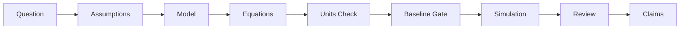

# Research Partner: AI-Assisted Physics Research Harness

Research Partner is a discipline-first harness designed to ensure scientific rigor when collaborating with AI assistants on physics research. It bridges the gap between AI's creative speed and the slow, methodical discipline required for physical discovery.

## 🚀 Key Features

### 1. The Scientific Chain of Integrity
Never lose track of your reasoning. Research Partner enforces a strict, traceable path from the initial physical question to the final manuscript claim.

### 2. Automated Discipline Gates (Skills)
Instead of vague instructions, the harness uses **specialized skills** that act like TDD for research:
- **`model-specification`**: Forces explicit definitions of variables, domains, and validity regimes.
- **`dimensional-analysis`**: Automatically flags unit inconsistencies before you waste hours on a simulation.
- **`baseline-validation`**: A mandatory gate that requires your model to pass a "toy model" or "analytical limit" test before interpreting real results.

### 3. Visual Workflow Navigation
The harness generates an **Interactive Workflow Map** (`docs/workflow_map.html`). It provides a real-time dashboard showing:
- Which step you are currently on.
- The "gates" you have passed (or are currently blocked by).
- Direct links to the relevant logs, figures, and evidence.

---

## 🛠 Usage by Platform

Research Partner is designed to work seamlessly across major AI CLI environments. The AI will automatically pick up rules from the project root.

| Platform | Skill Invocation | Rule Discovery File |
|---|---|---|
| **Gemini CLI** | `activate_skill(name="...")` | `GEMINI.md` |
| **Claude Code** | `Skill(name="...")` | `CLAUDE.md` / `AGENTS.md` |
| **Copilot CLI / Codex** | `skill(name="...")` | `AGENTS.md` |

### Step-by-Step Setup

1. **Initialization**: Copy the `skills/`, `docs/`, and `scripts/` directories along with `AGENTS.md`/`GEMINI.md` into your research project root.
2. **Launch CLI**: Open your preferred terminal and launch the AI CLI (e.g., `gemini`, `claude`, or `gh copilot`).
3. **Trigger the Workflow**:
   - **Gemini CLI**: Simply state your goal: *"I want to analyze the stability of [Model Name]."* The AI will see `GEMINI.md` and should automatically call `activate_skill(name="model-specification")`.
   - **Claude Code**: Ask: *"Use the model-specification skill to define my new system."* Claude will use its `Skill` tool to load the instructions.
   - **Copilot CLI**: The assistant will leverage `AGENTS.md` to guide its behavior and will invoke `skill` as needed.
4. **Follow the Gates**: The AI will guide you through recording assumptions in `docs/assumptions.md` and checking baselines before running any code.

---

## 🛠 How to Utilize Research Partner

### Scenario A: Starting a New Discovery
1. **Brainstorm & Plan**: Use the `research-plan-review` skill to audit your initial idea for unit consistency and baseline targets.
2. **Execute & Validate**: Run small, verifiable iterations. The harness will block you from making "big claims" until the `claim-to-evidence` map is filled.
3. **Reflect**: Every iteration ends with a `research-retrospective`, leaving behind a reusable benchmark or a "lesson learned" log.

### Scenario B: Retrofitting an Existing Project
1. **Inventory**: Run `python scripts/audit_existing_project.py` to map your current figures and scripts.
2. **Validate Gaps**: Identify which previous results are "unvalidated" and create a `retrofit_validation_plan`.
3. **Safe Evolution**: Start applying the discipline gates to *new* changes while gradually bringing old results into the "Chain of Integrity."

---

## 📊 Visualizing Success

When you use Research Partner, your research output isn't just a paper—it's a **reproducible lineage**.

- **Workflow Maps**: Run `python scripts/generate_workflow_map.py` and open `docs/workflow_map.html` to see the logic flow of your research.
- **Claim-to-Evidence Maps**: Hover over a sentence in your draft and see exactly which simulation run and which equation supports it.
- **Baseline Registry**: A library of "sanity checks" that ensure your future models don't drift from physical reality.

---

## 🔭 The Vision

Research Partner isn't about replacing the researcher; it's about **augmenting human judgment with machine-enforced discipline**. It ensures that the AI stays focused on the physics, while you stay focused on the discovery.

---
*Ready to start? Begin by inspecting `GEMINI.md` to see the AI's operating instructions.*
