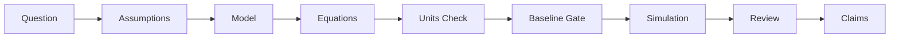

# Research Partner: AI-Assisted Physics Research Harness

Research Partner is a discipline-first harness designed to ensure scientific rigor when collaborating with AI assistants on physics research. It bridges the gap between AI's creative speed and the slow, methodical discipline required for physical discovery.

## 🚀 Key Features

### 1. The Scientific Chain of Integrity
Never lose track of your reasoning. Research Partner enforces a strict, traceable path from the initial physical question to the final manuscript claim.



### 2. Automated Discipline Gates (Skills)
Instead of vague instructions, the harness uses **specialized skills** that act like TDD for research:
- **`model-specification`**: Forces explicit definitions of variables, domains, and validity regimes.
- **`dimensional-analysis`**: Automatically flags unit inconsistencies before you waste hours on a simulation.
- **`baseline-validation`**: A mandatory gate that requires your model to pass a "toy model" or "analytical limit" test before interpreting real results.

### 3. Visual Workflow Navigation
The harness generates an **Interactive Workflow Map** (`docs/workflow_map.html`). It provides a real-time dashboard showing:
- Which step you are currently on.
- The "gates" you have passed (or are currently blocked by).
- Direct links to the relevant logs, figures, and evidence.

---

## 🛠 Installation Guide

Research Partner is installed by placing its instruction files, skill library, workflow documents, and helper scripts inside the root of the research project that should be governed by the harness. After installation, your AI coding or research CLI reads the local instructions first, uses the `skills/` directory for discipline-specific procedures, and writes workflow evidence into `docs/` and run-specific directories.

### 1. Prerequisites

- A local research project directory where the harness should run, for example `C:\MyPhysicsProject`.
- Python 3.10 or newer available as `python` from the terminal. The bundled helper scripts use the Python standard library only; no `pip install` step is required for the harness itself.
- An AI assistant that reads repository instructions:
  - **Codex / Copilot-style agents** read `AGENTS.md`.
  - **Gemini CLI** reads `GEMINI.md`.
  - **Claude Code** can use `AGENTS.md` or a project-specific `CLAUDE.md` if you choose to add one.
- Git is recommended but not required. It lets the assistant checkpoint coherent harness or research milestones after validation.

### 2. Choose the Installation Target

Install Research Partner into the root of the project whose scientific workflow you want to protect. The project root is the directory that contains, or will contain, your research code, data notes, figures, and manuscript materials.

For a new project:

```powershell
mkdir C:\MyPhysicsProject
cd C:\MyPhysicsProject
```

For an existing project:

```powershell
cd C:\ExistingPhysicsProject
```

Do not install run outputs back into the harness source repository. Run-specific evidence should live in a separate run directory, normally under a sibling root such as `C:\ResearchPartner-runs\YYYY-MM-DD-topic-name\`.

### 3. Copy the Harness Files

From this repository, copy these required items into the target project root:

```text
AGENTS.md
GEMINI.md
PHYSICS.md
skills/
docs/
scripts/
```

Optional but useful items:

```text
README.md
tests/
.gitignore
```

Do not copy transient runtime artifacts such as `outputs/`, `__pycache__/`, `.pytest_cache/`, temporary run folders, or another repository's `.git/` directory.

In PowerShell, from the Research Partner source directory:

```powershell
$SOURCE = "C:\ResearchPartner"
$TARGET = "C:\MyPhysicsProject"

Copy-Item "$SOURCE\AGENTS.md" "$TARGET\AGENTS.md" -Force
Copy-Item "$SOURCE\GEMINI.md" "$TARGET\GEMINI.md" -Force
Copy-Item "$SOURCE\PHYSICS.md" "$TARGET\PHYSICS.md" -Force
Copy-Item "$SOURCE\skills" "$TARGET\skills" -Recurse -Force
Copy-Item "$SOURCE\docs" "$TARGET\docs" -Recurse -Force
Copy-Item "$SOURCE\scripts" "$TARGET\scripts" -Recurse -Force
```

If you later change the local harness contract, keep `AGENTS.md` and `GEMINI.md` synchronized. They are the same behavioral contract for different assistant runtimes.

### 4. Verify the Installation

Run these checks from the target project root:

```powershell
python scripts\evaluate_harness.py
python scripts\validate_workflow_links.py
python scripts\generate_workflow_map.py
```

Expected result:

- The evaluation script should report the realistic research scenarios covered by the harness.
- The link validator should not report broken workflow-document links.
- `docs\workflow_map.html` and `docs\workflow_map.json` should be regenerated and reviewable.

If your terminal cannot find `python`, try `py -3` in place of `python`.

### 5. Confirm Platform Routing

Research Partner works by giving each AI CLI a local instruction file plus a skill directory. The activation mechanism varies by tool:

| Platform | Skill Invocation | Rule Discovery File |
|---|---|---|
| **Gemini CLI** | `activate_skill(name="...")` | `GEMINI.md` |
| **Claude Code** | `Skill(name="...")` | `CLAUDE.md` / `AGENTS.md` |
| **Copilot CLI / Codex** | `skill(name="...")` | `AGENTS.md` |

After launching the assistant in the target project root, ask for a small workflow action before starting real research:

```text
Use the research-plan-review skill to help me define a small validation target.
```

The assistant should classify the task, load the relevant skill, ask for assumptions or review checkpoints when needed, and avoid jumping directly into unsupported simulation or manuscript claims.

### 6. Start the First Run

For a new run-specific artifact set, use the scaffolder from the installed project root:

```powershell
python scripts\start_research_run.py --name "damped oscillator baseline"
```

This creates a dated run directory with the live workflow packet, Cartographer update template, literature workspace, outputs directory, and initial research documents. Use that run directory for evidence, figures, logs, and workflow state; keep the project root focused on reusable harness files, source code, and durable documentation.

For an existing research project, begin with onboarding instead of reorganizing files:

```powershell
python scripts\audit_existing_project.py
```

Then use `docs\adoption\existing_results_inventory.md` and `docs\adoption\retrofit_validation_plan.md` to mark which figures, scripts, and claims are validated, partial, unknown, or not yet checked.

### 7. Operating Rule After Installation

Once installed, use the harness by asking the assistant to work inside the scientific loop:

```text
Orient -> Interview -> Specify -> Seed -> Validate -> Execute -> Evaluate -> Review -> Retrospect
```

The important behavior is not that every script runs automatically. The important behavior is that assumptions, units, baseline gates, parameters, evidence links, figure provenance, claim strength, and researcher review checkpoints stay visible before the project moves from code or plots into scientific interpretation.

---

## 🛠 How to Utilize Research Partner

### Scenario A: Starting a New Discovery
1. **Brainstorm & Plan**: Use the `research-plan-review` skill to audit your initial idea for unit consistency and baseline targets.
2. **Execute & Validate**: Run small, verifiable iterations. The harness will block you from making "big claims" until the `claim-to-evidence` map is filled.
3. **Reflect**: Every iteration ends with a `research-retrospective`, leaving behind a reusable benchmark or a "lesson learned" log.

### Scenario B: Retrofitting an Existing Project
1. **Inventory**: Run `python scripts/audit_existing_project.py` to map your current figures and scripts.
2. **Validate Gaps**: Identify which previous results are "unvalidated" and create a `retrofit_validation_plan`.
3. **Safe Evolution**: Start applying the discipline gates to *new* changes while gradually bringing old results into the "Chain of Integrity."

---

## 📊 Visualizing Success

When you use Research Partner, your research output isn't just a paper—it's a **reproducible lineage**.

- **Workflow Maps**: Run `python scripts/generate_workflow_map.py` and open `docs/workflow_map.html` to see the logic flow of your research.
- **Claim-to-Evidence Maps**: Hover over a sentence in your draft and see exactly which simulation run and which equation supports it.
- **Baseline Registry**: A library of "sanity checks" that ensure your future models don't drift from physical reality.

---

## 🔭 The Vision

Research Partner isn't about replacing the researcher; it's about **augmenting human judgment with machine-enforced discipline**. It ensures that the AI stays focused on the physics, while you stay focused on the discovery.

---
*Ready to start? Begin by inspecting `GEMINI.md` to see the AI's operating instructions.*
