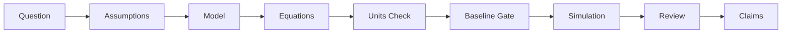
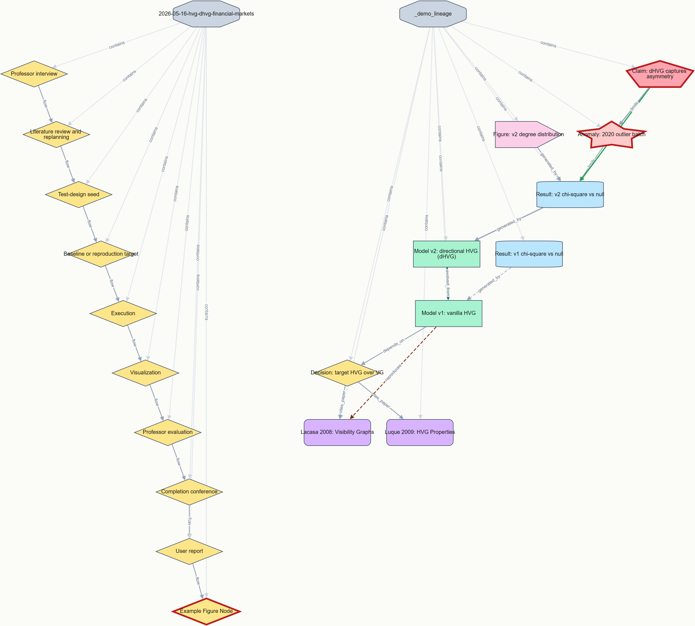

# Research Partner: AI-Assisted Physics Research Harness

Research Partner is a discipline-first harness designed to ensure scientific rigor when collaborating with AI assistants on physics research. It bridges the gap between AI's creative speed and the slow, methodical discipline required for physical discovery.

[한국어 README](README.ko.md)

## 🚀 Key Features

### 1. The Scientific Chain of Integrity
Never lose track of your reasoning. Research Partner enforces a strict, traceable path from the initial physical question to the final manuscript claim.



### 2. Automated Discipline Gates (Skills)
Instead of vague instructions, the harness uses **specialized skills** that act like TDD for research:
- **`model-specification`**: Forces explicit definitions of variables, domains, and validity regimes.
- **`dimensional-analysis`**: Automatically flags unit inconsistencies before you waste hours on a simulation.
- **`baseline-validation`**: A mandatory gate that requires your model to pass a "toy model" or "analytical limit" test before interpreting real results.

### 3. Visual Workflow Navigation
The harness generates an **Interactive Workflow Map** (`docs/workflow_map.html`) and a **Current Run Dashboard** (`ResearchPartner-runs/.../workflow_map.html`) for the latest active run. It provides a real-time dashboard showing:
- Which step you are currently on.
- The "gates" you have passed (or are currently blocked by).
- A clickable Action Queue for input, approval, and recommended review items.
- Direct links to the recommended researcher-facing documents, logs, figures, and evidence.
- A Lucidchart-style **Lineage tab** that visualizes Papers → Decisions → Model Versions → Results → Claims with Cytoscape.js + dagre (vendored under `docs/vendor/`, no internet required). Edge color encodes relation, edge width encodes `evidence_strength`, stale/broken links turn orange/red. Filter by lineage kind, claim ceiling, or "review-pending only". A **Cross-Run Lineage** tab appears once `python scripts/build_lineage_graph.py` has produced `ResearchPartner-runs/_index/lineage_graph.json`, connecting runs through `parent_run` / `evolved_from` / `reproduces` edges. To preview the tab end-to-end before your first real run, click **Load demo lineage** in the empty tab, or seed an illustrative `_demo_lineage` run with `python scripts/seed_lineage_demo.py` and rebuild the cross-run graph.

  

  Skill outputs auto-seed the lineage nodes (writing `literature/reviews/<id>.md` seeds a paper node, `docs/model_versions/<v>.md` seeds a model_version node, `docs/claims/<id>.md` seeds a claim node, etc. — handled by `scripts/workflow_hooks.py`); each skill's `Cartographer Update` section then instructs the agent to add the cross-referential edges (`cites_paper`, `evolved_from`, `reproduces`, `supports`, `limits`). The **Lineage Coverage Gate** (`python scripts/check_lineage_coverage.py --run <run-dir>`) warns when an agent skipped that step (claims without `supports`, non-initial model versions without `evolved_from`, orphan paper reviews, unresolved anomalies without `limits`). The **Broken-Edge Linter** (`python scripts/update_live_json.py --run <run-dir> --validate`) catches typos in `graph_links` references that Cytoscape would otherwise silently drop.

---

## 🛠 Installation Guide

Quick Start: install from inside the research project root with one command:

```powershell
python -c "import urllib.request; exec(urllib.request.urlopen('https://raw.githubusercontent.com/kisbi3/ResearchPartner/main/scripts/install.py').read())"
```

Then open your AI coding or research agent in that same directory and start with a small validation-oriented request:

```text
Use the research-plan-review skill to help me define a small validation target.
```

The installer downloads the current Research Partner harness, installs the instruction files, skill library, workflow documents, and helper scripts into the current project root, and leaves unrelated research files alone.

To update an existing harness installation, rerun the same command with `--force`:

```powershell
python -c "import urllib.request; exec(urllib.request.urlopen('https://raw.githubusercontent.com/kisbi3/ResearchPartner/main/scripts/install.py').read())" --force
```

### What You Get

After one disciplined research loop, a loose physics idea becomes a traceable research state: assumptions recorded, units checked, baseline targets identified, execution bounded, and claims capped by evidence.

| Step | Before | After |
|---|---|---|
| Orient | "Analyze this model" | Task classified as model specification, validation, simulation, figure audit, manuscript claim, anomaly debugging, or adoption work |
| Interview | Hidden assumptions | Physical object, observable, boundary conditions, approximation regime, units, and review checkpoint surfaced before execution |
| Specify | No stable research contract | Research plan with assumptions, validation target, observables, failure criteria, and claim-to-evidence path |
| Seed | Vague next action | Graduate test-design task with files, commands, inputs, outputs, pass/fail criteria, and failure handling |
| Validate | "Looks plausible" | Baseline gate: toy model, known limit, reproduction target, conservation check, dimensional sanity case, or explicit waiver |
| Execute | Unbounded coding or plotting | Bounded implementation that reports parameters, seeds, commands, outputs, and validation status |
| Evaluate | Interpretation drifts from output | Professor-led review separates observation, interpretation, speculation, and unsupported claims |
| Retrospect | Results disappear into chat | Reusable log entry, negative result, open question, workflow update, benchmark, or decision record |

What just happened? The harness forced the research object to become explicit before code, and forced the evidence chain to stay visible before interpretation.

### How It Compares

AI coding tools are powerful, but physics research fails when the input is scientifically under-specified or the claims outgrow the evidence.

| Topic | Vanilla AI Coding | Research Partner |
|---|---|---|
| Vague prompt | AI guesses intent and fills in physical assumptions silently | Socratic interview exposes assumptions before execution |
| Units and regimes | Unit conversions, nondimensionalization, and approximations can drift unnoticed | Assumption, unit-conversion, and approximation-regime hooks record the model's domain |
| Baseline validation | A simulation may be interpreted after it merely runs | Baseline gate blocks interpretation until a toy model, known limit, reproduction, or waiver exists |
| Numerical work | Timestep, grid, tolerance, seed, and sweep changes may be buried in code | Parameter, stability, convergence, uncertainty, and reproducibility hooks keep run metadata visible |
| Figures | A plot can become a claim without provenance | Figure provenance links script, command, data, parameters, output path, and caption claim |
| Manuscript claims | Language often strengthens during editing | Claim-strength and manuscript-drift hooks downgrade unsupported language |
| Anomalies | Symptoms get patched first | Anomaly hook classifies expected vs observed behavior before fixing |
| Review | Manual "looks good" review | Professor-led evaluation plus researcher checkpoints and visible workflow state |

### The Loop

Research Partner is not a decorative workflow chart. The loop is the research method:

```text
Orient -> Interview -> Specify -> Seed -> Validate -> Execute -> Evaluate -> Review -> Retrospect
    ^                                                                                 |
    +----------------------------- Evolutionary Loop ---------------------------------+
```

Each cycle should change the research state: a stronger validation gate, a clearer assumption, a rejected hypothesis, a cleaner figure lineage, a lower claim ceiling, or a better next question. The output of evaluation becomes the input to the next specification.

| Phase | What Happens |
|---|---|
| Orient | Classify the task and identify the responsible research role |
| Interview | Ask the first professor question and expose ambiguity |
| Specify | Record model meaning, assumptions, units, observables, and failure criteria |
| Seed | Convert the research seed into testable graduate-agent tasks |
| Validate | Check baseline, numerical stability, units, data lineage, or reproduction target |
| Execute | Run bounded coding, analysis, plotting, or literature-processing work |
| Evaluate | Separate supported observations from interpretation and speculation |
| Review | Present evidence, figures, stale artifacts, waivers, and checkpoints to the researcher |
| Retrospect | Preserve outcomes, negative results, open questions, and reusable checks |

Convergence is not "the code ran." Convergence means the current claim is no stronger than the current evidence chain.

### Commands

Use these commands from the installed project root. The assistant should invoke the matching skills and workflow hooks during conversation; the terminal commands create or validate durable artifacts.

| Need | Command | What It Does |
|---|---|---|
| Install harness | `python -c "import urllib.request; exec(urllib.request.urlopen('https://raw.githubusercontent.com/kisbi3/ResearchPartner/main/scripts/install.py').read())"` | Installs instructions, skills, docs, and scripts into the current project |
| Refresh harness | Same install command with `--force` | Overwrites managed harness files intentionally |
| Start run | `python scripts\start_research_run.py --name "topic name"` | Creates a dated run packet under a sibling `ResearchPartner-runs` root, including `docs\process\live_workflow_diagram.md` |
| Audit existing project | `python scripts\audit_existing_project.py` | Inventories scripts, figures, outputs, and validation gaps before retrofit |
| Evaluate harness | `python scripts\evaluate_harness.py` | Checks realistic scenarios for correct skills, gates, and blocked behaviors |
| Validate links | `python scripts\validate_workflow_links.py` | Checks workflow-document links |
| Generate workflow map | `python scripts\generate_workflow_map.py` | Builds `docs\workflow_map.html` and also refreshes the latest run's `workflow_map.html` and `workflow_map.json` |
| Include paper logic | `python scripts\generate_workflow_map.py --include-paper-logic` | Adds manuscript-logic view when paper planning explicitly starts |
| Scaffold paper review | `python scripts\scaffold_paper_review.py --run <run-dir> --paper-id P1 --title "Title"` | Creates a reusable paper review note and updates the literature index |
| Process paper PDF | `python scripts\process_paper_for_review.py --run <run-dir> --paper-id P1 --title "Title" --pdf <pdf-path>` | Scaffolds review, extracts text, and drafts provisional extraction notes |
| Check paper review | `python scripts\check_paper_review_quality.py <review-path>` | Blocks weak paper notes before they support novelty or reproduction claims |
| Check contract sync | `python scripts\check_contract_sync.py` | Enforces byte-identical `AGENTS.md` and `GEMINI.md` so both runtimes follow the same contract |
| Check orient gate | `python scripts\check_orient_recorded.py --run <run-dir>` | Blocks Seed, Execute, or Evaluate work unless `docs/orient_note.md` contains the task-intake output (classification, role, first question, researcher answer) |
| Check interview gate | `python scripts\check_interview_recorded.py --run <run-dir>` | Blocks Seed or Execute work unless `docs/interview_notes.md` contains the professor-interview output (crystallized question, assumptions, agreed direction) |
| Check literature gate | `python scripts\check_literature_reviewed.py --run <run-dir>` | Blocks model-specification or seed-design unless `docs/literature_review_plan.md` has `## Literature Gate Status: ready/waived`, or `docs/literature_skip_waiver.md` exists with a reason (lowers claim ceiling to `interpretation`) |
| Check model gate | `python scripts\check_model_specified.py --run <run-dir>` | Blocks seed-design or execute unless `docs/model_spec.md` has physical system and governing equations, or `docs/model_skip_waiver.md` exists with a reason (lowers claim ceiling to `observation`) |
| Check baseline strategy gate | `python scripts\check_baseline_strategy.py --run <run-dir>` | Blocks seed-design unless `docs/baseline_strategy.md` records the professor-graduate student decision (`variation` or `new model`) and a quantitative verification target. No skip waiver. |
| Check baseline gate | `python scripts\check_baseline_gate.py --run <run-dir>` | Blocks downstream work unless `baseline_registry.md` has a `pass` entry, or a `waived` entry with claim ceiling lowered to `observation` in the live workflow |
| Check figure provenance | `python scripts\check_figure_provenance.py --root <run-dir>` | Fails if any figure file lacks a sibling `*.provenance.md` or a matching entry in `figure_provenance.md` |
| Check session resumption | `python scripts\check_session_resumable.py` | After a usage-limit cutoff or other interruption, lists in-flight sub-agent tasks (`spawned` rows in the live workflow diagram) and blocked or `in_progress` gates that the researcher must resolve before the next session continues. Auto-discovers the latest run; pass `--run <run-dir>` to target a specific run, `--json` for machine-readable output |

### The Research Minds

For substantial work, the harness behaves like a professor-led research group rather than a single code generator.

| Agent stance | Role | Core question |
|---|---|---|
| Socratic Interviewer | Questions-only; never builds | What are you assuming? |
| Ontologist | Finds essence, not symptoms | What is this, really? |
| Seed Architect | Crystallizes specs from dialogue | Is this complete and unambiguous? |
| Evaluator | Performs staged verification | Did we build the right thing? |
| Contrarian | Challenges every assumption | What if the opposite were true? |
| Hacker | Finds unconventional paths | What constraints are actually real? |
| Simplifier | Removes complexity | What is the simplest thing that could work? |
| Researcher | Stops coding and starts investigating | What evidence do we actually have? |
| Architect | Identifies structural causes | If we started over, would we build it this way? |

These stances support five operational roles: the Lead Agent owns scientific judgment and claim discipline; the Peer-Review Professor is an adversarial external reviewer invoked only within `meeting` sessions, with no project history, whose sole job is to find holes in claims; Graduate Test-Design Agents turn the plan into validation tasks; Coding Subagents execute bounded implementation only after the validation strategy is clear; the Cartographer (hook-driven, not spawned) records workflow state without adding opinions or strengthening claims.

For substantial work, the spawned roles below the Lead Agent are enforced by *actually spawning separate agents* using the `Agent()` tool — not by one agent switching personas internally. The Lead Agent itself is the main conversation context (not a spawned subagent); the concrete 2-tier spawn hierarchy beneath it is: **Lead Agent** → **Graduate Student Agent(s)** (one per seed task, spawned in parallel when independent) → **Implementation Agent** + **Scientific Validator** + **Cache-Log Auditor** (spawned by each Graduate Student as needed). Graduate Students are bound to a single task instance, not to a task type — there is no "baseline student" vs "scan student". See the "Agent Spawning Protocol" section of `docs/orchestration_protocol.md` for the spawn block templates and cross-tier prohibitions.

### Installed Skills

The installer copies these skills into the target project's `skills/` directory. The assistant should load them on demand instead of treating the README as the full operating manual.

| Skill | Use It When |
|---|---|
| `task-intake` | Starting any research task — classifies the work type, assigns research roles, and surfaces the first professor question before execution begins (Orient phase) |
| `research-plan-review` | Planning a substantial simulation, analysis workflow, figure set, reproduction attempt, or manuscript-claim strategy |
| `model-specification` | Defining or reviewing a physical model, variables, equations, assumptions, parameters, constraints, or validity regime |
| `dimensional-analysis` | Equations, units, scaling laws, nondimensionalization, or dimensionless groups are involved |
| `baseline-validation` | A model, solver, analysis pipeline, figure workflow, or interpretation needs a toy model, known limit, benchmark, or reproduction check |
| `seed-design` | Converting an approved research plan into concrete graduate-agent tasks with files, commands, inputs, outputs, pass/fail criteria, and failure handling (Seed phase) |
| `numerical-validation` | Running, modifying, or interpreting simulations, solvers, convergence checks, stability checks, or computational validation |
| `claim-to-evidence` | Reviewing manuscript text, captions, abstracts, conclusions, or any scientific claim that needs evidence mapping |
| `scientific-verification-before-claim` | Making, strengthening, publishing, summarizing, captioning, or editing a claim based on equations, simulations, figures, data, or citations |
| `anomaly-debugging` | A result, simulation, plot, fit, derivation, unit check, conservation law, or reproduction behaves unexpectedly |
| `researcher-review-loop` | Presenting intermediate results, deciding next steps, comparing iterations, or recording researcher decisions |
| `cartographer-update` | Updating live workflow state when the active phase changes, a gate passes or blocks, a waiver is issued, an artifact becomes stale, or a researcher checkpoint is reached |
| `research-retrospective` | Ending an iteration, validation run, reproduction attempt, anomaly investigation, figure audit, manuscript revision, or review |
| `existing-research-onboarding` | Adding the harness to a project that already has code, data, figures, simulations, notes, results, or manuscript claims |
| `literature-review-planning` | Literature access, novelty assessment, researcher-provided PDFs, reproduction targets, or prior methods could change the plan |
| `baseline-strategy` | After model-specification — professor-graduate student dialogue to decide variation vs. new model and fix the first verification target before seed-design begins |
| `meeting` | "Does this make sense?" needs an outside perspective — convenes a structured multi-agent review (`--scope quick/review/full`, `--on "<question>"`). Invocable at any point in the workflow. |
| `peer-review-professor` | Adversarial reviewer role used inside `meeting` sessions — fresh eyes only, no project history, finds holes in claims using five stances |
| `graduate-student` | Loaded by a spawned Graduate Student agent — owns one seed task's execution strategy, sub-agent coordination, anomaly escalation, and evidence reporting |
| `implementation-agent` | Loaded by a spawned Implementation Agent — writes code to `src/` only; does not run code, judge results, or interpret physics |
| `scientific-validator` | Loaded by a spawned Scientific Validator — runs scripts via `run_with_capture.py`, applies pre-set pass/fail criteria mechanically, does not modify code or strengthen claims |
| `cache-log-auditor` | Loaded by a spawned Cache-Log Auditor (always after Scientific Validator) — runs `audit_run_outputs.py` to verify that `logs/`, `errors/`, and `cache/` contain sufficient artifacts |
| `harness-evaluation` | Checking whether the harness itself is useful, followed, lightweight enough, and effective across realistic scenarios |

### 1. Prerequisites

- A local research project directory where the harness should run, for example `C:\MyPhysicsProject`.
- Python 3.10 or newer available as `python` from the terminal. The bundled helper scripts use the Python standard library only; no `pip install` step is required for the harness itself.
- An AI assistant that reads repository instructions:
  - **Codex / Copilot-style agents** read `AGENTS.md`.
  - **Gemini CLI** reads `GEMINI.md`.
  - **Claude Code** can use `AGENTS.md` or a project-specific `CLAUDE.md` if you choose to add one.
- Git is recommended but not required. It lets the assistant checkpoint coherent harness or research milestones after validation.

### 2. Install Into the Project Root

Install Research Partner into the root of the project whose scientific workflow you want to protect. The project root is the directory that contains, or will contain, your research code, data notes, figures, and manuscript materials.

For a new project:

```powershell
mkdir C:\MyPhysicsProject
cd C:\MyPhysicsProject
```

For an existing project:

```powershell
cd C:\ExistingPhysicsProject
```

Do not install run outputs back into the harness source repository. Run-specific evidence should live in a separate run directory, normally under a sibling root such as `C:\ResearchPartner-runs\YYYY-MM-DD-topic-name\`.

The one-line installer places these managed harness items in the target project:

```text
AGENTS.md
GEMINI.md
PHYSICS.md
skills/
docs/
scripts/
```

It does not install transient runtime artifacts such as `outputs/`, `__pycache__/`, `.pytest_cache/`, temporary run folders, or another repository's `.git/` directory. Existing managed harness files are protected by default; use `--force` only when you intentionally want to refresh `AGENTS.md`, `GEMINI.md`, `PHYSICS.md`, `skills/`, `docs/`, and `scripts/`.

If you later change the local harness contract, keep `AGENTS.md` and `GEMINI.md` synchronized. They are the same behavioral contract for different assistant runtimes.

### 3. Verify the Installation

Run these checks from the target project root:

```powershell
python scripts\evaluate_harness.py
python scripts\validate_workflow_links.py
python scripts\generate_workflow_map.py
```

Expected result:

- The evaluation script should report the realistic research scenarios covered by the harness.
- The link validator should not report broken workflow-document links.
- `docs\workflow_map.html` should be regenerated, and when a run exists the latest run should also contain `workflow_map.html` and `workflow_map.json`.

If your terminal cannot find `python`, try `py -3` in place of `python`.

### 4. Confirm Platform Routing

Research Partner works by giving each AI CLI a local instruction file plus a skill directory. The activation mechanism varies by tool:

| Platform | Skill Invocation | Rule Discovery File |
|---|---|---|
| **Gemini CLI** | `activate_skill(name="...")` | `GEMINI.md` |
| **Claude Code** | `Skill(name="...")` | `CLAUDE.md` / `AGENTS.md` |
| **Copilot CLI / Codex** | `skill(name="...")` | `AGENTS.md` |

After launching the assistant in the target project root, ask for a small workflow action before starting real research:

```text
Use the research-plan-review skill to help me define a small validation target.
```

The assistant should classify the task, load the relevant skill, ask for assumptions or review checkpoints when needed, and avoid jumping directly into unsupported simulation or manuscript claims.

### 5. Start the First Run

For a new run-specific artifact set, use the scaffolder from the installed project root:

```powershell
python scripts\start_research_run.py --name "damped oscillator baseline"
```

This creates a dated run directory with the live workflow at `docs\process\live_workflow_diagram.md`, Cartographer update template, literature workspace, outputs directory, and initial research documents. Use that run directory for evidence, figures, logs, and workflow state; keep the project root focused on reusable harness files, source code, and durable documentation. Run `python scripts\generate_workflow_map.py` after Cartographer updates to refresh both the central `docs\workflow_map.html` and the latest run-local `workflow_map.html` dashboard; older runs that used `docs\live_workflow_diagram.md` are still supported as a fallback.

For an existing research project, begin with onboarding instead of reorganizing files:

```powershell
python scripts\audit_existing_project.py
```

Then use `docs\adoption\existing_results_inventory.md` and `docs\adoption\retrofit_validation_plan.md` to mark which figures, scripts, and claims are validated, partial, unknown, or not yet checked.

### 6. Manual Local Install Fallback

If you already have a local checkout of Research Partner and do not want the installer to download from GitHub, run this from anywhere:

```powershell
python C:\ResearchPartner\scripts\install.py --source C:\ResearchPartner --target C:\MyPhysicsProject
```

Use `--force` with the local installer only when overwriting an existing harness installation is intended.

### 7. Operating Rule After Installation

Once installed, use the harness by asking the assistant to work inside the scientific loop:

```text
Orient -> Interview -> Specify -> Seed -> Validate -> Execute -> Evaluate -> Review -> Retrospect
```

The important behavior is not that every script runs automatically. The important behavior is that assumptions, units, baseline gates, parameters, evidence links, figure provenance, claim strength, and researcher review checkpoints stay visible before the project moves from code or plots into scientific interpretation.

When the harness itself changes, user-facing documentation is part of the change. Any added, removed, renamed, or materially changed harness feature, script, skill, command, workflow, installation behavior, or user-facing capability must update both `README.md` and `README.ko.md` in the same checkpoint, unless the change is explicitly internal and non-user-facing.

---

## 🛠 How to Utilize Research Partner

### Scenario A: Starting a New Discovery
1. **Brainstorm & Plan**: Use the `research-plan-review` skill to audit your initial idea for unit consistency and baseline targets.
2. **Execute & Validate**: Run small, verifiable iterations. The harness will block you from making "big claims" until the `claim-to-evidence` map is filled.
3. **Reflect**: Every iteration ends with a `research-retrospective`, leaving behind a reusable benchmark or a "lesson learned" log.

### Scenario B: Retrofitting an Existing Project
1. **Inventory**: Run `python scripts/audit_existing_project.py` to map your current figures and scripts.
2. **Validate Gaps**: Identify which previous results are "unvalidated" and create a `retrofit_validation_plan`.
3. **Safe Evolution**: Start applying the discipline gates to *new* changes while gradually bringing old results into the "Chain of Integrity."

---

## 📊 Visualizing Success

When you use Research Partner, your research output isn't just a paper—it's a **reproducible lineage**.

- **Workflow Maps**: Run `python scripts/generate_workflow_map.py` and open the latest run's `workflow_map.html` to use the current research dashboard. The Action Queue surfaces researcher input, approval, review items, linked documents, and suggested next commands; `docs/workflow_map.html` remains the central generated copy.
- **Claim-to-Evidence Maps**: Hover over a sentence in your draft and see exactly which simulation run and which equation supports it.
- **Baseline Registry**: A library of "sanity checks" that ensure your future models don't drift from physical reality.

---

## 🔭 The Vision

Research Partner isn't about replacing the researcher; it's about **augmenting human judgment with machine-enforced discipline**. It ensures that the AI stays focused on the physics, while you stay focused on the discovery.

---
*Ready to start? Begin by inspecting `GEMINI.md` to see the AI's operating instructions.*
