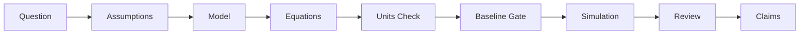

# Research Partner: AI-Assisted Physics Research Harness

Research Partner is a discipline-first harness designed to ensure scientific rigor when collaborating with AI assistants on physics research. It bridges the gap between AI's creative speed and the slow, methodical discipline required for physical discovery.

## 🚀 Key Features

### 1. The Scientific Chain of Integrity
Never lose track of your reasoning. Research Partner enforces a strict, traceable path from the initial physical question to the final manuscript claim.



### 2. Automated Discipline Gates (Skills)
Instead of vague instructions, the harness uses **specialized skills** that act like TDD for research:
- **`model-specification`**: Forces explicit definitions of variables, domains, and validity regimes.
- **`dimensional-analysis`**: Automatically flags unit inconsistencies before you waste hours on a simulation.
- **`baseline-validation`**: A mandatory gate that requires your model to pass a "toy model" or "analytical limit" test before interpreting real results.

### 3. Visual Workflow Navigation
The harness generates an **Interactive Workflow Map** (`docs/workflow_map.html`). It provides a real-time dashboard showing:
- Which step you are currently on.
- The "gates" you have passed (or are currently blocked by).
- Direct links to the relevant logs, figures, and evidence.

---

## 🛠 Installation Guide

Quick Start: install from inside the research project root with one command:

```powershell
python -c "import urllib.request; exec(urllib.request.urlopen('https://raw.githubusercontent.com/kisbi3/ResearchPartner/main/scripts/install.py').read())"
```

Then open your AI coding or research agent in that same directory and start with a small validation-oriented request:

```text
Use the research-plan-review skill to help me define a small validation target.
```

The installer downloads the current Research Partner harness, installs the instruction files, skill library, workflow documents, and helper scripts into the current project root, and leaves unrelated research files alone.

To update an existing harness installation, rerun the same command with `--force`:

```powershell
python -c "import urllib.request; exec(urllib.request.urlopen('https://raw.githubusercontent.com/kisbi3/ResearchPartner/main/scripts/install.py').read())" --force
```

### What You Get

After one disciplined research loop, a loose physics idea becomes a traceable research state: assumptions recorded, units checked, baseline targets identified, execution bounded, and claims capped by evidence.

| Step | Before | After |
|---|---|---|
| Orient | "Analyze this model" | Task classified as model specification, validation, simulation, figure audit, manuscript claim, anomaly debugging, or adoption work |
| Interview | Hidden assumptions | Physical object, observable, boundary conditions, approximation regime, units, and review checkpoint surfaced before execution |
| Specify | No stable research contract | Research plan with assumptions, validation target, observables, failure criteria, and claim-to-evidence path |
| Seed | Vague next action | Graduate test-design task with files, commands, inputs, outputs, pass/fail criteria, and failure handling |
| Validate | "Looks plausible" | Baseline gate: toy model, known limit, reproduction target, conservation check, dimensional sanity case, or explicit waiver |
| Execute | Unbounded coding or plotting | Bounded implementation that reports parameters, seeds, commands, outputs, and validation status |
| Evaluate | Interpretation drifts from output | Professor-led review separates observation, interpretation, speculation, and unsupported claims |
| Retrospect | Results disappear into chat | Reusable log entry, negative result, open question, workflow update, benchmark, or decision record |

What just happened? The harness forced the research object to become explicit before code, and forced the evidence chain to stay visible before interpretation.

### How It Compares

AI coding tools are powerful, but physics research fails when the input is scientifically under-specified or the claims outgrow the evidence.

| Topic | Vanilla AI Coding | Research Partner |
|---|---|---|
| Vague prompt | AI guesses intent and fills in physical assumptions silently | Socratic interview exposes assumptions before execution |
| Units and regimes | Unit conversions, nondimensionalization, and approximations can drift unnoticed | Assumption, unit-conversion, and approximation-regime hooks record the model's domain |
| Baseline validation | A simulation may be interpreted after it merely runs | Baseline gate blocks interpretation until a toy model, known limit, reproduction, or waiver exists |
| Numerical work | Timestep, grid, tolerance, seed, and sweep changes may be buried in code | Parameter, stability, convergence, uncertainty, and reproducibility hooks keep run metadata visible |
| Figures | A plot can become a claim without provenance | Figure provenance links script, command, data, parameters, output path, and caption claim |
| Manuscript claims | Language often strengthens during editing | Claim-strength and manuscript-drift hooks downgrade unsupported language |
| Anomalies | Symptoms get patched first | Anomaly hook classifies expected vs observed behavior before fixing |
| Review | Manual "looks good" review | Professor-led evaluation plus researcher checkpoints and visible workflow state |

### The Loop

Research Partner is not a decorative workflow chart. The loop is the research method:

```text
Orient -> Interview -> Specify -> Seed -> Validate -> Execute -> Evaluate -> Review -> Retrospect
    ^                                                                                 |
    +----------------------------- Evolutionary Loop ---------------------------------+
```

Each cycle should change the research state: a stronger validation gate, a clearer assumption, a rejected hypothesis, a cleaner figure lineage, a lower claim ceiling, or a better next question. The output of evaluation becomes the input to the next specification.

| Phase | What Happens |
|---|---|
| Orient | Classify the task and identify the responsible research role |
| Interview | Ask the first professor question and expose ambiguity |
| Specify | Record model meaning, assumptions, units, observables, and failure criteria |
| Seed | Convert the research seed into testable graduate-agent tasks |
| Validate | Check baseline, numerical stability, units, data lineage, or reproduction target |
| Execute | Run bounded coding, analysis, plotting, or literature-processing work |
| Evaluate | Separate supported observations from interpretation and speculation |
| Review | Present evidence, figures, stale artifacts, waivers, and checkpoints to the researcher |
| Retrospect | Preserve outcomes, negative results, open questions, and reusable checks |

Convergence is not "the code ran." Convergence means the current claim is no stronger than the current evidence chain.

### Commands

Use these commands from the installed project root. The assistant should invoke the matching skills and workflow hooks during conversation; the terminal commands create or validate durable artifacts.

| Need | Command | What It Does |
|---|---|---|
| Install harness | `python -c "import urllib.request; exec(urllib.request.urlopen('https://raw.githubusercontent.com/kisbi3/ResearchPartner/main/scripts/install.py').read())"` | Installs instructions, skills, docs, and scripts into the current project |
| Refresh harness | Same install command with `--force` | Overwrites managed harness files intentionally |
| Start run | `python scripts\start_research_run.py --name "topic name"` | Creates a dated run packet under a sibling `ResearchPartner-runs` root |
| Audit existing project | `python scripts\audit_existing_project.py` | Inventories scripts, figures, outputs, and validation gaps before retrofit |
| Evaluate harness | `python scripts\evaluate_harness.py` | Checks realistic scenarios for correct skills, gates, and blocked behaviors |
| Validate links | `python scripts\validate_workflow_links.py` | Checks workflow-document links |
| Generate workflow map | `python scripts\generate_workflow_map.py` | Builds `docs\workflow_map.html` and `docs\workflow_map.json` |
| Include paper logic | `python scripts\generate_workflow_map.py --include-paper-logic` | Adds manuscript-logic view when paper planning explicitly starts |
| Scaffold paper review | `python scripts\scaffold_paper_review.py --run <run-dir> --paper-id P1 --title "Title"` | Creates a reusable paper review note and updates the literature index |
| Process paper PDF | `python scripts\process_paper_for_review.py --run <run-dir> --paper-id P1 --title "Title" --pdf <pdf-path>` | Scaffolds review, extracts text, and drafts provisional extraction notes |
| Check paper review | `python scripts\check_paper_review_quality.py <review-path>` | Blocks weak paper notes before they support novelty or reproduction claims |

### The Research Minds

For substantial work, the harness behaves like a professor-led research group rather than a single code generator.

| Agent stance | Role | Core question |
|---|---|---|
| Socratic Interviewer | Questions-only; never builds | What are you assuming? |
| Ontologist | Finds essence, not symptoms | What is this, really? |
| Seed Architect | Crystallizes specs from dialogue | Is this complete and unambiguous? |
| Evaluator | Performs staged verification | Did we build the right thing? |
| Contrarian | Challenges every assumption | What if the opposite were true? |
| Hacker | Finds unconventional paths | What constraints are actually real? |
| Simplifier | Removes complexity | What is the simplest thing that could work? |
| Researcher | Stops coding and starts investigating | What evidence do we actually have? |
| Architect | Identifies structural causes | If we started over, would we build it this way? |

These stances support four operational roles: the Professor Orchestrator owns scientific judgment and claim discipline; Graduate Test-Design Agents turn the plan into validation tasks; Coding Subagents execute bounded implementation only after the validation strategy is clear; the Diagram/Cartographer Agent records workflow state without adding opinions or strengthening claims.

### Installed Skills

The installer copies these skills into the target project's `skills/` directory. The assistant should load them on demand instead of treating the README as the full operating manual.

| Skill | Use It When |
|---|---|
| `research-plan-review` | Planning a substantial simulation, analysis workflow, figure set, reproduction attempt, or manuscript-claim strategy |
| `model-specification` | Defining or reviewing a physical model, variables, equations, assumptions, parameters, constraints, or validity regime |
| `dimensional-analysis` | Equations, units, scaling laws, nondimensionalization, or dimensionless groups are involved |
| `baseline-validation` | A model, solver, analysis pipeline, figure workflow, or interpretation needs a toy model, known limit, benchmark, or reproduction check |
| `numerical-validation` | Running, modifying, or interpreting simulations, solvers, convergence checks, stability checks, or computational validation |
| `claim-to-evidence` | Reviewing manuscript text, captions, abstracts, conclusions, or any scientific claim that needs evidence mapping |
| `scientific-verification-before-claim` | Making, strengthening, publishing, summarizing, captioning, or editing a claim based on equations, simulations, figures, data, or citations |
| `anomaly-debugging` | A result, simulation, plot, fit, derivation, unit check, conservation law, or reproduction behaves unexpectedly |
| `researcher-review-loop` | Presenting intermediate results, deciding next steps, comparing iterations, or recording researcher decisions |
| `research-retrospective` | Ending an iteration, validation run, reproduction attempt, anomaly investigation, figure audit, manuscript revision, or review |
| `existing-research-onboarding` | Adding the harness to a project that already has code, data, figures, simulations, notes, results, or manuscript claims |
| `literature-review-planning` | Literature access, novelty assessment, researcher-provided PDFs, reproduction targets, or prior methods could change the plan |
| `harness-evaluation` | Checking whether the harness itself is useful, followed, lightweight enough, and effective across realistic scenarios |

## 🇰🇷 한국어 안내

Research Partner는 물리 연구에서 AI가 빠르게 코드를 만들기 전에, 연구 질문과 증거 사슬이 먼저 명확해지도록 강제하는 하네스입니다. 핵심은 자동화가 아니라 연구 규율입니다: 물리적 가정 -> 모델 정의 -> 해석적 점검 -> 수치 구현 -> 검증 -> 그림 -> 원고 주장으로 이어지는 경로를 계속 보이게 만듭니다.

### 빠른 시작

연구 프로젝트 루트에서 한 줄로 설치합니다:

```powershell
python -c "import urllib.request; exec(urllib.request.urlopen('https://raw.githubusercontent.com/kisbi3/ResearchPartner/main/scripts/install.py').read())"
```

그 다음 같은 디렉터리에서 AI 코딩/연구 에이전트를 열고 작은 검증 중심 요청으로 시작합니다:

```text
research-plan-review skill을 사용해서 작은 validation target을 정의해줘.
```

기존 설치를 갱신하려면 `--force`를 명시합니다:

```powershell
python -c "import urllib.request; exec(urllib.request.urlopen('https://raw.githubusercontent.com/kisbi3/ResearchPartner/main/scripts/install.py').read())" --force
```

### 설치하면 생기는 것

| 단계 | 이전 | 이후 |
|---|---|---|
| Orient | "이 모델 분석해줘" | 작업이 모델 명세, 검증, 시뮬레이션, 그림 점검, 원고 주장, 이상 현상, 기존 프로젝트 도입 등으로 분류됨 |
| Interview | 숨은 가정이 남아 있음 | 물리적 대상, 관측량, 경계조건, 근사 영역, 단위, 연구자 확인 지점이 드러남 |
| Specify | 안정된 연구 계약이 없음 | 가정, 검증 대상, 관측량, 실패 기준, claim-to-evidence 경로가 있는 연구 계획으로 정리됨 |
| Seed | 다음 행동이 모호함 | 파일, 명령, 입력, 출력, pass/fail 기준, 실패 처리까지 포함한 검증 과제로 바뀜 |
| Validate | "그럴듯해 보임" | toy model, 알려진 극한, 재현 대상, 보존법칙, 차원 sanity check, 또는 명시적 waiver가 필요함 |
| Execute | 코딩/플로팅이 무제한으로 진행됨 | 파라미터, seed, 명령, 출력, 검증 상태를 보고하는 bounded execution으로 제한됨 |
| Evaluate | 출력보다 해석이 강해짐 | 관찰, 해석, 추측, 지원되지 않는 주장을 분리함 |
| Retrospect | 결과가 채팅에 흩어짐 | 로그, negative result, open question, workflow update, benchmark, decision record로 남음 |

### 일반 AI 코딩과의 차이

| 주제 | 일반 AI 코딩 | Research Partner |
|---|---|---|
| 모호한 프롬프트 | AI가 의도를 추측하고 물리 가정을 조용히 채움 | Socratic interview로 실행 전에 가정을 드러냄 |
| 단위와 근사 | 단위 변환, 무차원화, 근사 영역이 흐려질 수 있음 | assumption/unit/approximation hook으로 모델의 적용 영역을 기록함 |
| baseline 검증 | 코드가 실행되면 결과를 해석하기 쉬움 | toy model, known limit, reproduction, waiver 없이는 해석을 막음 |
| 수치 작업 | timestep, grid, tolerance, seed 변경이 코드 안에 묻힘 | parameter, stability, convergence, reproducibility hook으로 metadata를 남김 |
| 그림 | plot이 바로 주장으로 바뀔 수 있음 | figure provenance가 script, command, data, parameter, output path, caption claim을 연결함 |
| 원고 주장 | 편집 중 표현이 강해짐 | claim-strength/manuscript-drift hook이 근거 없는 표현을 낮춤 |
| 이상 현상 | 증상을 먼저 패치함 | expected vs observed를 분리하고 anomaly type을 먼저 분류함 |

### 연구 루프

```text
Orient -> Interview -> Specify -> Seed -> Validate -> Execute -> Evaluate -> Review -> Retrospect
    ^                                                                                 |
    +----------------------------- Evolutionary Loop ---------------------------------+
```

한 사이클은 단순 반복이 아니라 연구 상태의 진화여야 합니다. 더 강한 검증 gate, 더 명확한 가정, 폐기된 가설, 더 깨끗한 figure lineage, 낮아진 claim ceiling, 또는 더 좋은 다음 질문 중 하나를 남겨야 합니다.

### 주요 명령

| 필요 | 명령 | 역할 |
|---|---|---|
| 설치 | `python -c "import urllib.request; exec(urllib.request.urlopen('https://raw.githubusercontent.com/kisbi3/ResearchPartner/main/scripts/install.py').read())"` | 현재 프로젝트에 instruction, skills, docs, scripts 설치 |
| 갱신 | 설치 명령 + `--force` | 관리되는 하네스 파일을 의도적으로 덮어씀 |
| 새 run 시작 | `python scripts\start_research_run.py --name "topic name"` | sibling `ResearchPartner-runs` 아래 dated run packet 생성 |
| 기존 프로젝트 점검 | `python scripts\audit_existing_project.py` | 기존 script, figure, output, validation gap 인벤토리 |
| 하네스 평가 | `python scripts\evaluate_harness.py` | 현실적인 연구 시나리오에서 skill/gate/blocked behavior 점검 |
| 링크 검증 | `python scripts\validate_workflow_links.py` | workflow 문서 링크 검증 |
| workflow map 생성 | `python scripts\generate_workflow_map.py` | `docs\workflow_map.html` 및 `docs\workflow_map.json` 생성 |
| 논문 logic 포함 | `python scripts\generate_workflow_map.py --include-paper-logic` | 원고 계획을 명시적으로 시작했을 때 paper-logic view 추가 |

### 설치되는 Skills

| Skill | 언제 쓰는가 |
|---|---|
| `research-plan-review` | 큰 시뮬레이션, 분석 workflow, figure set, reproduction, manuscript claim 전략을 실행하기 전 |
| `model-specification` | 물리 모델, 변수, 방정식, 가정, 파라미터, 제약, validity regime을 정의/검토할 때 |
| `dimensional-analysis` | 방정식, 물리 파라미터, 단위, scaling law, 무차원화, dimensionless group이 등장할 때 |
| `baseline-validation` | 새 모델/solver/분석 pipeline/figure workflow/해석에 toy model, known limit, benchmark, reproduction check가 필요할 때 |
| `numerical-validation` | simulation, numerical solver, convergence, stability, computational validation을 실행/수정/해석할 때 |
| `claim-to-evidence` | 초록, 서론, 결과, 토론, 결론, caption, 원고 문장 등 claim과 evidence를 연결해야 할 때 |
| `scientific-verification-before-claim` | 방정식, simulation, figure, data, citation에 의존하는 주장을 만들거나 강화하기 전 |
| `anomaly-debugging` | 결과, simulation, plot, fit, derivation, unit check, conservation law, reproduction이 예상과 다를 때 |
| `researcher-review-loop` | 중간 결과를 보여주고 다음 행동을 결정하거나 연구자 결정을 기록할 때 |
| `research-retrospective` | iteration, validation run, reproduction, anomaly investigation, figure audit, manuscript revision이 끝났을 때 |
| `existing-research-onboarding` | 이미 code/data/figure/simulation/note/result/manuscript claim이 있는 프로젝트에 하네스를 붙일 때 |
| `literature-review-planning` | novelty, prior methods, reproduction target, 연구자 제공 PDF가 연구 방향을 바꿀 수 있을 때 |
| `harness-evaluation` | 하네스 자체가 실제 연구 시나리오에서 잘 작동하는지 평가할 때 |

### 1. Prerequisites

- A local research project directory where the harness should run, for example `C:\MyPhysicsProject`.
- Python 3.10 or newer available as `python` from the terminal. The bundled helper scripts use the Python standard library only; no `pip install` step is required for the harness itself.
- An AI assistant that reads repository instructions:
  - **Codex / Copilot-style agents** read `AGENTS.md`.
  - **Gemini CLI** reads `GEMINI.md`.
  - **Claude Code** can use `AGENTS.md` or a project-specific `CLAUDE.md` if you choose to add one.
- Git is recommended but not required. It lets the assistant checkpoint coherent harness or research milestones after validation.

### 2. Install Into the Project Root

Install Research Partner into the root of the project whose scientific workflow you want to protect. The project root is the directory that contains, or will contain, your research code, data notes, figures, and manuscript materials.

For a new project:

```powershell
mkdir C:\MyPhysicsProject
cd C:\MyPhysicsProject
```

For an existing project:

```powershell
cd C:\ExistingPhysicsProject
```

Do not install run outputs back into the harness source repository. Run-specific evidence should live in a separate run directory, normally under a sibling root such as `C:\ResearchPartner-runs\YYYY-MM-DD-topic-name\`.

The one-line installer places these managed harness items in the target project:

```text
AGENTS.md
GEMINI.md
PHYSICS.md
skills/
docs/
scripts/
```

It does not install transient runtime artifacts such as `outputs/`, `__pycache__/`, `.pytest_cache/`, temporary run folders, or another repository's `.git/` directory. Existing managed harness files are protected by default; use `--force` only when you intentionally want to refresh `AGENTS.md`, `GEMINI.md`, `PHYSICS.md`, `skills/`, `docs/`, and `scripts/`.

If you later change the local harness contract, keep `AGENTS.md` and `GEMINI.md` synchronized. They are the same behavioral contract for different assistant runtimes.

### 3. Verify the Installation

Run these checks from the target project root:

```powershell
python scripts\evaluate_harness.py
python scripts\validate_workflow_links.py
python scripts\generate_workflow_map.py
```

Expected result:

- The evaluation script should report the realistic research scenarios covered by the harness.
- The link validator should not report broken workflow-document links.
- `docs\workflow_map.html` and `docs\workflow_map.json` should be regenerated and reviewable.

If your terminal cannot find `python`, try `py -3` in place of `python`.

### 4. Confirm Platform Routing

Research Partner works by giving each AI CLI a local instruction file plus a skill directory. The activation mechanism varies by tool:

| Platform | Skill Invocation | Rule Discovery File |
|---|---|---|
| **Gemini CLI** | `activate_skill(name="...")` | `GEMINI.md` |
| **Claude Code** | `Skill(name="...")` | `CLAUDE.md` / `AGENTS.md` |
| **Copilot CLI / Codex** | `skill(name="...")` | `AGENTS.md` |

After launching the assistant in the target project root, ask for a small workflow action before starting real research:

```text
Use the research-plan-review skill to help me define a small validation target.
```

The assistant should classify the task, load the relevant skill, ask for assumptions or review checkpoints when needed, and avoid jumping directly into unsupported simulation or manuscript claims.

### 5. Start the First Run

For a new run-specific artifact set, use the scaffolder from the installed project root:

```powershell
python scripts\start_research_run.py --name "damped oscillator baseline"
```

This creates a dated run directory with the live workflow packet, Cartographer update template, literature workspace, outputs directory, and initial research documents. Use that run directory for evidence, figures, logs, and workflow state; keep the project root focused on reusable harness files, source code, and durable documentation.

For an existing research project, begin with onboarding instead of reorganizing files:

```powershell
python scripts\audit_existing_project.py
```

Then use `docs\adoption\existing_results_inventory.md` and `docs\adoption\retrofit_validation_plan.md` to mark which figures, scripts, and claims are validated, partial, unknown, or not yet checked.

### 6. Manual Local Install Fallback

If you already have a local checkout of Research Partner and do not want the installer to download from GitHub, run this from anywhere:

```powershell
python C:\ResearchPartner\scripts\install.py --source C:\ResearchPartner --target C:\MyPhysicsProject
```

Use `--force` with the local installer only when overwriting an existing harness installation is intended.

### 7. Operating Rule After Installation

Once installed, use the harness by asking the assistant to work inside the scientific loop:

```text
Orient -> Interview -> Specify -> Seed -> Validate -> Execute -> Evaluate -> Review -> Retrospect
```

The important behavior is not that every script runs automatically. The important behavior is that assumptions, units, baseline gates, parameters, evidence links, figure provenance, claim strength, and researcher review checkpoints stay visible before the project moves from code or plots into scientific interpretation.

---

## 🛠 How to Utilize Research Partner

### Scenario A: Starting a New Discovery
1. **Brainstorm & Plan**: Use the `research-plan-review` skill to audit your initial idea for unit consistency and baseline targets.
2. **Execute & Validate**: Run small, verifiable iterations. The harness will block you from making "big claims" until the `claim-to-evidence` map is filled.
3. **Reflect**: Every iteration ends with a `research-retrospective`, leaving behind a reusable benchmark or a "lesson learned" log.

### Scenario B: Retrofitting an Existing Project
1. **Inventory**: Run `python scripts/audit_existing_project.py` to map your current figures and scripts.
2. **Validate Gaps**: Identify which previous results are "unvalidated" and create a `retrofit_validation_plan`.
3. **Safe Evolution**: Start applying the discipline gates to *new* changes while gradually bringing old results into the "Chain of Integrity."

---

## 📊 Visualizing Success

When you use Research Partner, your research output isn't just a paper—it's a **reproducible lineage**.

- **Workflow Maps**: Run `python scripts/generate_workflow_map.py` and open `docs/workflow_map.html` to see the logic flow of your research.
- **Claim-to-Evidence Maps**: Hover over a sentence in your draft and see exactly which simulation run and which equation supports it.
- **Baseline Registry**: A library of "sanity checks" that ensure your future models don't drift from physical reality.

---

## 🔭 The Vision

Research Partner isn't about replacing the researcher; it's about **augmenting human judgment with machine-enforced discipline**. It ensures that the AI stays focused on the physics, while you stay focused on the discovery.

---
*Ready to start? Begin by inspecting `GEMINI.md` to see the AI's operating instructions.*
