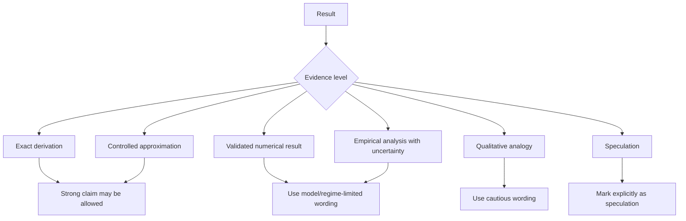

# Paper Logic Diagram

Use this before turning research output into manuscript structure.

## Paper Logic Flow

## Claim Support Flow

## Manuscript Section Roles

| Section | Logic Role | Gate |
|---|---|---|
| Introduction | Question and gap | Novelty needs citation support |
| Model / Theory | Assumptions and equations | Variables, units, validity regime |
| Methods | Reproducible procedure | Baseline and validation records |
| Results | Evidence | Figure/table provenance and uncertainty |
| Discussion | Interpretation | Claim-to-evidence discipline |
| Limitations | Boundaries | Negative results and open questions visible |
| Conclusion | Supported answer | No stronger than claim gate |
