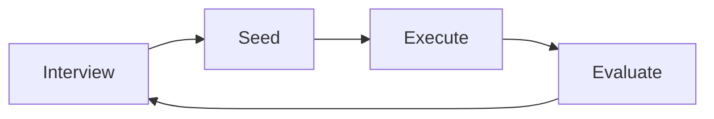

# Live Workflow Diagram Template

Use this file as the Diagram/Cartographer Agent's live artifact for a substantial research run.

The Diagram/Cartographer Agent listens to the Professor Orchestrator, Graduate Test-Design Agents, and Coding Subagents. It does not give project opinions, infer mechanisms, judge scientific meaning, or strengthen claims. This artifact records process state only.

## Active Step

- Current step:
- Current owner:
- Last update:

## Workflow Diagram

## Gate Status

| Gate | Status | Note |
|---|---|---|
| Professor interview | pending |  |
| Test-design seed | pending |  |
| Baseline or reproduction target | pending |  |
| Execution | pending |  |
| Visualization | pending |  |
| Professor evaluation | pending |  |
| Completion conference | pending |  |
| User report | pending |  |

Allowed status values: `pending`, `pass`, `partial`, `fail`, `blocked`, `waived`.

## Evidence Links

- `docs/research_plan.md`
- `docs/baseline_registry.md`
- `docs/validation_log.md`
- `docs/researcher_review_log.md`
- `docs/research_retrospective.md`

## Blocked Behaviors

- No scientific claim is supported by this workflow diagram alone.
- Do not treat visualization as quantitative validation.
- Do not accept reproduction without comparing against the intended target.
- Do not let coding subagents strengthen claim language.

## Next Review Checkpoint

- Researcher decision needed:
- Question to ask:
- Smallest useful next action:
