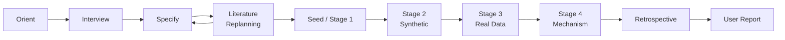

# Live Workflow Diagram Template

Use this file as the Diagram/Cartographer Agent's live artifact for a substantial research run.

The Diagram/Cartographer Agent listens to the Professor Orchestrator, Graduate Test-Design Agents, and Coding Subagents. It does not give project opinions, infer mechanisms, judge scientific meaning, or strengthen claims. This artifact records process state only.

## Active Step

- Current step:
- Current owner:
- Last update:

## Workflow Diagram

Node labels show gate status emoji as they update: 🔄 in_progress · ✓ pass · ◑ partial · ❌ fail · ⛔ blocked · ⚠ waived



## Gate Status

| Gate | Status | Note |
|---|---|---|
| Professor interview | pending |  |
| Literature review and replanning | pending |  |
| Test-design seed | pending |  |
| Baseline or reproduction target | pending |  |
| Execution | pending |  |
| Visualization | pending |  |
| Professor evaluation | pending |  |
| Completion conference | pending |  |
| User report | pending |  |

Allowed status values: `pending`, `in_progress` 🔄, `pass` ✓, `partial` ◑, `fail` ❌, `blocked` ⛔, `waived` ⚠.

Update gate status in real time with:
```
python scripts/update_workflow_diagram.py --event start --step "..." --agent "..." --gate "Gate Name" --gate-status in_progress
```

## Evidence Links

- `docs/research_plan.md`
- `docs/literature_review_plan.md`
- `docs/paper_request_queue.md`
- `docs/replanning_memo.md`
- `literature/index.md`
- `literature/reviews/`
- `literature/extracted_text/`
- `docs/baseline_registry.md`
- `docs/validation_log.md`
- `docs/researcher_review_log.md`
- `docs/research_retrospective.md`

## Cartographer Update Events

Agents should send small update packets here whenever their work changes workflow state. The Diagram/Cartographer Agent records these packets as live linked research graph nodes. It must not infer scientific meaning or strengthen claims.

Allowed node types: `question`, `assumption`, `model`, `equation`, `parameter`, `baseline`, `validation`, `run`, `dataset`, `figure`, `table`, `anomaly`, `waiver`, `claim`, `decision`, `review`, `retrospective`, `open_issue`.

Allowed relations: `depends_on`, `implements`, `defines_parameter`, `runs_validation`, `generates_figure`, `computes_observable`, `generated_by`, `computed_from`, `supports`, `contradicts`, `limits`, `blocks`, `waived_by`, `supersedes`, `interprets`, `documents`, `requires_review`.

Allowed Link Status values: `fresh`, `stale`, `missing`, `broken`, `pending_review`, `superseded`.

Allowed Evidence Strength values: `none`, `weak`, `moderate`, `strong`, `contradictory`.

Allowed claim ceilings: `observation`, `interpretation`, `mechanism`, `generalization`, `unsupported`.

Use `requires_researcher_review: true` as the Researcher Checkpoint Marker when the researcher should inspect a result, waiver, anomaly, or claim before the next step.

Use `preview: thumbnail`, `preview: table_head`, or `preview: log_tail` as the Artifact Preview hint when the workflow map should show or summarize an artifact.

```json
{
  "cartographer_update": {
    "from": "coding-subagent",
    "event_type": "figure",
    "node_id": "example-figure-node",
    "title": "Example Figure Node",
    "node_type": "figure",
    "summary": "Replace this with the observed workflow update.",
    "status": "pending_review",
    "link_status": "pending_review",
    "evidence_strength": "none",
    "claim_ceiling": "observation",
    "review_owner": "professor",
    "requires_researcher_review": true,
    "code_links": [
      {
        "path": "scripts/example.py",
        "line": 1,
        "role": "replace with exact code role",
        "relation": "generates_figure",
        "status": "pending_review"
      }
    ],
    "result_links": [
      {
        "path": "outputs/example.png",
        "kind": "figure",
        "relation": "generated_by",
        "status": "pending_review",
        "preview": "thumbnail"
      }
    ],
    "interpretation_links": [
      {
        "path": "docs/validation_log.md",
        "anchor": "example",
        "relation": "documents_uncertainty",
        "status": "pending_review"
      }
    ],
    "graph_links": [
      {
        "from": "example-run-node",
        "to": "example-figure-node",
        "relation": "generated_by",
        "status": "pending_review"
      }
    ]
  }
}
```

## Blocked Behaviors

- No scientific claim is supported by this workflow diagram alone.
- Do not treat visualization as quantitative validation.
- Do not accept reproduction without comparing against the intended target.
- Do not let coding subagents strengthen claim language.

## Next Review Checkpoint

- Researcher decision needed:
- Question to ask:
- Smallest useful next action:

## Real-Time Event Log

<!-- Auto-updated by scripts/update_workflow_diagram.py via PreToolUse/PostToolUse hooks -->

