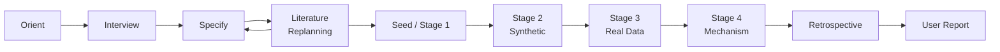

# Live Workflow Diagram Template

Use this file as the live process-state artifact for a substantial research run. It records which phase the project is in, which gates have passed, and which Agent() spawns are in-flight — nothing more.

This file is managed by two complementary systems:

- **`workflow_hooks.py`** — auto-updates the In-Flight Tasks table and Real-Time Event Log on every `Agent()` spawn (pre/post hooks). No manual intervention needed.
- **`/sync-workflow`** — regenerates the Gate Status table and the live JSON (`workflow_map.live.json`) by walking the project filesystem. Run it after completing a gate step.

## Active Step

- Current step:
- Current owner:
- Last update:

## Workflow Diagram

Node labels show gate status emoji as they update: 🔄 in_progress · ✓ pass · ◑ partial · ❌ fail · ⛔ blocked · ⚠ waived

## Gate Status

| Gate | Status | Note |
|---|---|---|
| Orient gate | pending |  |
| Interview gate | pending |  |
| Literature review and replanning | pending |  |
| Test-design seed | pending |  |
| Baseline or reproduction target | pending |  |
| Execution | pending |  |
| Visualization | pending |  |
| Professor evaluation | pending |  |
| Completion conference | pending |  |
| User report | pending |  |

Allowed status values: `pending`, `in_progress` 🔄, `pass` ✓, `partial` ◑, `fail` ❌, `blocked` ⛔, `waived` ⚠.

Run `/sync-workflow` to update gate statuses from the filesystem automatically.

## Evidence Links

- `docs/plan/research_plan.md`
- `docs/plan/model_spec.md`
- `docs/plan/baseline_strategy.md`
- `docs/literature/literature_review_plan.md`
- `docs/literature/paper_request_queue.md`
- `docs/literature/replanning_memo.md`
- `literature/index.md`
- `literature/reviews/`
- `literature/extracted_text/`
- `docs/gates/orient_note.md`
- `docs/gates/interview_notes.md`
- `docs/gates/baseline_registry.md`
- `docs/gates/validation_log.md`
- `docs/process/researcher_review_log.md`
- `docs/process/research_retrospective.md`

## Blocked Behaviors

- No scientific claim is supported by this workflow diagram alone.
- Do not treat visualization as quantitative validation.
- Do not accept reproduction without comparing against the intended target.
- Do not let coding subagents strengthen claim language.

## Next Review Checkpoint

- Researcher decision needed:
- Question to ask:
- Smallest useful next action:

## In-Flight Tasks

<!-- Auto-updated by scripts/workflow_hooks.py on every Agent() spawn (pre/post hooks).
     Rows in `spawned` state at session start are candidate abandoned tasks
     that the Professor Orchestrator must resolve before resuming. -->

| Task ID | Sub-agent | Spawned (UTC) | Step | Evidence Record | Status |
|---|---|---|---|---|---|

Allowed in-flight status values: `spawned`, `acknowledged`, `abandoned`.

The spawn hook (`workflow_hooks.py pre`) records each `Agent()` call automatically. No manual command is needed. After a session interruption, run `python scripts/check_session_resumable.py` to list any rows still in `spawned` state.

## Real-Time Event Log

<!-- Auto-updated by scripts/workflow_hooks.py on every Agent() spawn. -->
