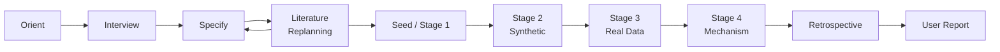

# Live Workflow Diagram Template

Use this file as the Cartographer (hook-driven, not spawned)'s live artifact for a substantial research run.

The Cartographer (hook-driven, not spawned) listens to the Lead Agent, Graduate Test-Design Agents, and Coding Subagents. It does not give project opinions, infer mechanisms, judge scientific meaning, or strengthen claims. This artifact records process state only.

## Active Step

- Current step:
- Current owner:
- Last update:

## Workflow Diagram

Node labels show gate status emoji as they update: 🔄 in_progress · ✓ pass · ◑ partial · ❌ fail · ⛔ blocked · ⚠ waived



## Gate Status

| Gate | Status | Note |
|---|---|---|
| Professor interview | pending |  |
| Literature review and replanning | pending |  |
| Test-design seed | pending |  |
| Baseline or reproduction target | pending |  |
| Execution | pending |  |
| Visualization | pending |  |
| Professor evaluation | pending |  |
| Completion conference | pending |  |
| User report | pending |  |

Allowed status values: `pending`, `in_progress` 🔄, `pass` ✓, `partial` ◑, `fail` ❌, `blocked` ⛔, `waived` ⚠.

Update gate status in real time with:
```
python scripts/update_workflow_diagram.py --event start --step "..." --agent "..." --gate "Gate Name" --gate-status in_progress
```

## Evidence Links

- `docs/plan/research_plan.md`
- `docs/plan/model_spec.md`
- `docs/plan/baseline_strategy.md`
- `docs/literature/literature_review_plan.md`
- `docs/literature/paper_request_queue.md`
- `docs/literature/replanning_memo.md`
- `literature/index.md`
- `literature/reviews/`
- `literature/extracted_text/`
- `docs/gates/orient_note.md`
- `docs/gates/interview_notes.md`
- `docs/gates/baseline_registry.md`
- `docs/gates/validation_log.md`
- `docs/process/researcher_review_log.md`
- `docs/process/research_retrospective.md`

## Cartographer Update Events

Update the live JSON directly with `scripts/update_live_json.py` whenever workflow state changes — gate pass/fail, active step, evidence links. See `skills/cartographer-update/SKILL.md` for the full event packet format and command examples. Allowed node types, relations, link-status values, evidence-strength values, and claim-ceiling values are defined in [`docs/orchestration_protocol.md`](../../../docs/orchestration_protocol.md#live-linked-research-graph).

Delete this section's content and replace with actual events as the run progresses. Leave no placeholder packets here.

## Blocked Behaviors

- No scientific claim is supported by this workflow diagram alone.
- Do not treat visualization as quantitative validation.
- Do not accept reproduction without comparing against the intended target.
- Do not let coding subagents strengthen claim language.

## Next Review Checkpoint

- Researcher decision needed:
- Question to ask:
- Smallest useful next action:

## In-Flight Tasks

<!-- Auto-updated by scripts/update_workflow_diagram.py via --event spawn / complete / error / resume.
     Rows in `spawned` state at session start are candidate abandoned tasks
     that the Professor Orchestrator must resolve before resuming. -->

| Task ID | Sub-agent | Spawned (UTC) | Step | Evidence Record | Status |
|---|---|---|---|---|---|

Allowed in-flight status values: `spawned`, `acknowledged`, `abandoned`.

Before spawning a sub-agent via `Agent()`, log the spawn so a future session
can detect it if this session is cut off:

```
python scripts/update_workflow_diagram.py --event spawn \
    --step "..." --agent "graduate-student" \
    --task-id "task-3-reproduce-guo" \
    --evidence-record "docs/gates/seed_design.md#task-3"
```

When the sub-agent reports back, mark the row acknowledged:

```
python scripts/update_workflow_diagram.py --event complete \
    --step "..." --agent "graduate-student" --task-id "task-3-reproduce-guo"
```

After a session interruption, run `python scripts/check_session_resumable.py`
to list any rows still in `spawned` state.

## Real-Time Event Log

<!-- Auto-updated by scripts/update_workflow_diagram.py via PreToolUse/PostToolUse hooks -->

