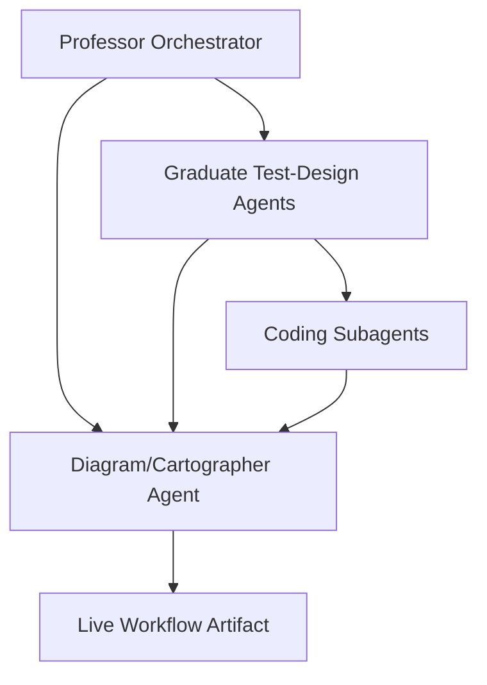
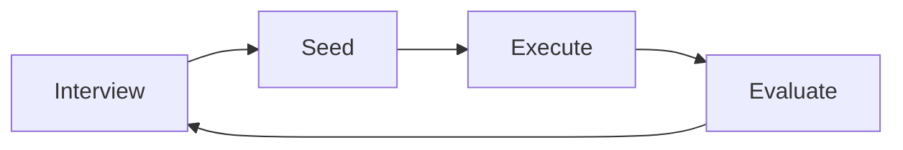
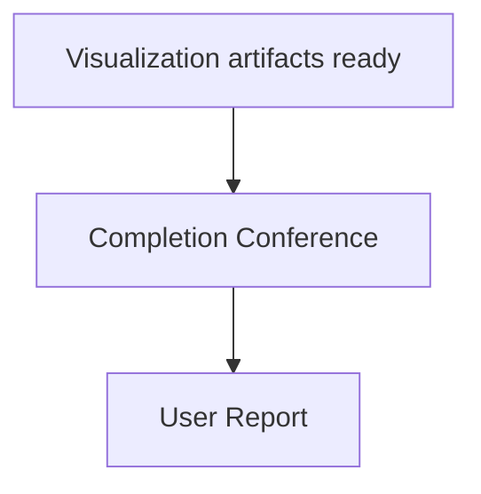

# Professor Orchestration Implementation Plan

> **For agentic workers:** REQUIRED SUB-SKILL: Use superpowers:subagent-driven-development (recommended) or superpowers:executing-plans to implement this plan task-by-task. Steps use checkbox (`- [ ]`) syntax for tracking.

**Goal:** Add a documented professor-led orchestration protocol, graduate test-design agents, bounded coding subagents, a non-opinionated Diagram/Cartographer Agent, and harness evaluation coverage.

**Architecture:** This is a documentation-first harness change. Root instruction files define required behavior, workflow docs show how the roles fit into the research loop, and the harness evaluator adds scenarios that detect skipped orchestration, skipped test design, unsafe coding subagent behavior, missing cartography, and missing completion conferences.

**Tech Stack:** Markdown documentation, Python dataclass-based evaluator, pytest.

---

## File Structure

- Modify `AGENTS.md`: add the multi-agent operating model to the local instructions while preserving existing physics discipline rules.
- Modify `GEMINI.md`: add identical text to keep it synchronized with `AGENTS.md`.
- Modify `docs/workflow_overview.md`: explain the professor-led operating loop and the final all-agent completion meeting.
- Modify `docs/workflow_diagrams.md`: add Mermaid diagrams for the orchestration hierarchy, evolutionary loop, and completion conference.
- Modify `docs/harness/harness_evaluation_scenarios.md`: add realistic evaluation scenarios for the new protocol.
- Modify `scripts/evaluate_harness.py`: add machine-checkable scenarios and rule terms.
- Modify `tests/test_evaluate_harness.py`: update expected scenario coverage and count.

## Task 1: Evaluator Tests

**Files:**
- Modify: `tests/test_evaluate_harness.py`

- [x] **Step 1: Write the failing test**

Replace the scenario tests with:

```python
def test_multi_agent_orchestration_scenarios_are_evaluated():
    evaluator = load_evaluator()

    names = [scenario.name for scenario in evaluator.SCENARIOS]

    assert "live_workflow_diagram_agent" in names
    assert "professor_orchestration" in names
    assert "graduate_test_design_agents" in names
    assert "coding_subagent_claim_discipline" in names
    assert "completion_conference_reporting" in names


def test_harness_evaluator_has_twelve_scenarios():
    evaluator = load_evaluator()

    assert len(evaluator.SCENARIOS) == 12
```

- [x] **Step 2: Run test to verify it fails**

Run: `python -m pytest tests/test_evaluate_harness.py -q`

Expected: FAIL because the new scenario names are not present and the count is still 8.

- [x] **Step 3: Commit checkpoint if Git is available**

Run:

```bash
git add tests/test_evaluate_harness.py
git commit -m "test: require orchestration harness scenarios"
```

If `git` is unavailable, record that in the final response.

## Task 2: Evaluator Scenarios

**Files:**
- Modify: `scripts/evaluate_harness.py`

- [x] **Step 1: Add four scenarios**

Add `Scenario(...)` entries for:

```python
Scenario(
    name="professor_orchestration",
    skills=(
        "skills/research-plan-review/SKILL.md",
        "skills/researcher-review-loop/SKILL.md",
        "skills/scientific-verification-before-claim/SKILL.md",
    ),
    docs=(
        "docs/workflow_overview.md",
        "docs/workflow_diagrams.md",
        "docs/research_plan.md",
        "docs/decision_log.md",
    ),
    rule_terms=(
        "Professor Orchestrator",
        "Socratic Interviewer",
        "Ontologist",
        "Seed Architect",
        "Evaluator",
        "Contrarian",
        "Hacker",
        "Simplifier",
        "Researcher",
        "Architect",
    ),
)
```

```python
Scenario(
    name="graduate_test_design_agents",
    skills=(
        "skills/research-plan-review/SKILL.md",
        "skills/baseline-validation/SKILL.md",
        "skills/numerical-validation/SKILL.md",
    ),
    docs=(
        "docs/research_plan.md",
        "docs/baseline_registry.md",
        "docs/validation_log.md",
    ),
    rule_terms=(
        "Graduate Test-Design Agents",
        "interview the professor",
        "interview coding subagents",
        "observables",
        "failure criteria",
    ),
)
```

```python
Scenario(
    name="coding_subagent_claim_discipline",
    skills=(
        "skills/numerical-validation/SKILL.md",
        "skills/scientific-verification-before-claim/SKILL.md",
    ),
    docs=(
        "docs/validation_log.md",
        "docs/decision_log.md",
    ),
    rule_terms=(
        "Coding Subagents",
        "bounded implementation",
        "should not decide",
        "stronger scientific claim",
    ),
)
```

```python
Scenario(
    name="completion_conference_reporting",
    skills=(
        "skills/researcher-review-loop/SKILL.md",
        "skills/research-retrospective/SKILL.md",
    ),
    docs=(
        "docs/researcher_review_log.md",
        "docs/research_retrospective.md",
        "docs/research_state.md",
    ),
    rule_terms=(
        "completion conference",
        "all agents",
        "visualization materials",
        "report to the user",
    ),
)
```

- [x] **Step 2: Strengthen live workflow scenario terms**

Update the `live_workflow_diagram_agent` `rule_terms` to include:

```python
"Diagram/Cartographer Agent",
"does not give project opinions",
"listens to the Professor Orchestrator",
"live workflow artifact",
"must not strengthen scientific claims",
```

- [x] **Step 3: Run evaluator tests**

Run: `python -m pytest tests/test_evaluate_harness.py -q`

Expected: PASS after documentation terms are added in later tasks; until then, unit tests that only inspect scenario names and count should pass once the script is updated.

## Task 3: Root Instruction Files

**Files:**
- Modify: `AGENTS.md`
- Modify: `GEMINI.md`

- [x] **Step 1: Add synchronized operating protocol**

Insert the same Markdown section in both files after the role section:

```markdown
## Professor-Led Multi-Agent Orchestration

For substantial research plans, existing-project reviews, reproduction attempts, simulation campaigns, analysis pipelines, figure sets, or manuscript-claim work, organize the work as a professor-led research group:

- **Professor Orchestrator**: owns scientific judgment, assumptions, model meaning, validation gates, evidence sufficiency, reproduction fidelity, and final claim discipline.
- **Graduate Test-Design Agents**: convert broad professor-assigned tasks into testable validation strategies through interviews with the professor, then interview coding subagents to make implementation tasks concrete.
- **Coding Subagents**: perform bounded implementation, analysis, or plotting tasks only after the test strategy is clear. They report commands, parameters, seeds, files, outputs, validation status, and failures. They do not strengthen scientific claims.
- **Diagram/Cartographer Agent**: listens to the Professor Orchestrator, Graduate Test-Design Agents, and Coding Subagents, and updates the live workflow artifact in real time. It does not give project opinions, infer mechanisms, judge scientific meaning, or strengthen claims. It only records workflow state, gates, evidence links, blocked behaviors, and review checkpoints.

The operating loop is:

```text
Interview -> Seed -> Execute -> Evaluate
    ^                                 |
    +-------- Evolutionary Loop ------+
```

The Professor Orchestrator should hold these stances when starting or reviewing a project:

| Agent stance | Role | Core question |
|---|---|---|
| Socratic Interviewer | Questions-only. Never builds. | What are you assuming? |
| Ontologist | Finds essence, not symptoms. | What is this, really? |
| Seed Architect | Crystallizes specs from dialogue. | Is this complete and unambiguous? |
| Evaluator | Performs staged verification. | Did we build the right thing? |
| Contrarian | Challenges every assumption. | What if the opposite were true? |
| Hacker | Finds unconventional paths. | What constraints are actually real? |
| Simplifier | Removes complexity. | What is the simplest thing that could work? |
| Researcher | Stops coding and starts investigating. | What evidence do we actually have? |
| Architect | Identifies structural causes. | If we started over, would we build it this way? |

When a reproduction, validation, figure-generation, or other substantial task is complete and visualization artifacts are ready, the Professor Orchestrator must convene a completion conference with the graduate agents, coding subagents, and Diagram/Cartographer Agent. The final report to the user must summarize the meeting, the workflow state, the visualization materials, evidence links, supported claims, unsupported claims, validation status, and remaining uncertainty.
```

- [x] **Step 2: Verify synchronization**

Run: `Compare-Object (Get-Content AGENTS.md) (Get-Content GEMINI.md)`

Expected: no output.

## Task 4: Workflow Documentation

**Files:**
- Modify: `docs/workflow_overview.md`
- Modify: `docs/workflow_diagrams.md`
- Modify: `docs/harness/harness_evaluation_scenarios.md`

- [x] **Step 1: Update workflow overview**

Add sections named:

```markdown
## Professor-Led Orchestration
## Diagram/Cartographer Agent
## Completion Conference
```

These sections must state that the Diagram/Cartographer Agent has no project-opinion authority and that it builds the live workflow by listening to the professor, graduate agents, and coding subagents.

- [x] **Step 2: Update workflow diagrams**

Add Mermaid diagrams for:







- [x] **Step 3: Update evaluation scenarios document**

Add scenarios matching the Python evaluator names:

- `Professor Orchestration`
- `Graduate Test-Design Agents`
- `Coding Subagent Claim Discipline`
- `Completion Conference Reporting`

Each scenario must include task prompt, risk, expected skills, expected docs, and expected blocked behavior.

## Task 5: Validation

**Files:**
- No direct file edits unless validation exposes a gap.

- [x] **Step 1: Check `plt.show()` was not introduced**

Run: `rg -n "plt\\.show\\("`

Expected: no matches.

- [x] **Step 2: Verify instruction synchronization**

Run: `Compare-Object (Get-Content AGENTS.md) (Get-Content GEMINI.md)`

Expected: no output.

- [x] **Step 3: Run tests**

Run: `python -m pytest tests/test_evaluate_harness.py tests/test_generate_workflow_map.py -q`

Expected: PASS.

- [x] **Step 4: Run harness evaluator**

Run: `python scripts/evaluate_harness.py`

Expected: no fail status in the report.

- [x] **Step 5: Record validation limits**

Final response must state this is a documentation-and-evaluation enforcement pass, not a full autonomous runtime-agent implementation.
