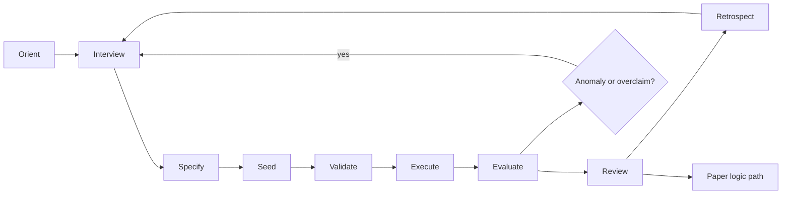
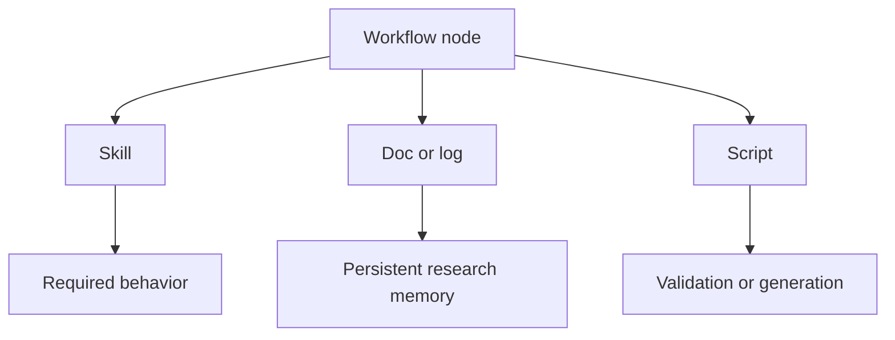
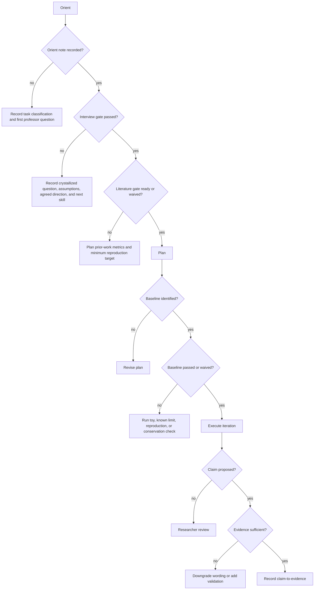
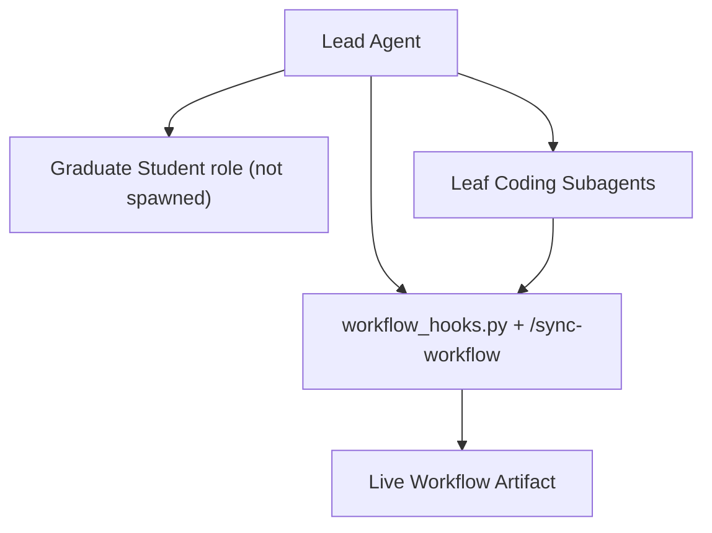
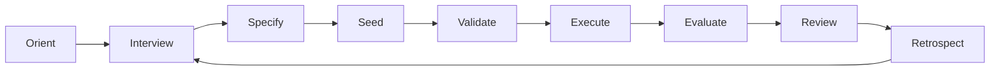
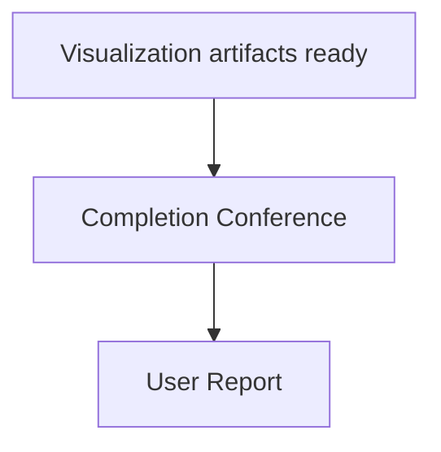

# Research Workflow Diagrams

## Research Workflow

## Scientific-Loop Hook Diagram

```mermaid
flowchart TB
    O["Orient"] --> TH["Task Intake Hook"]
    I["Interview"] --> AH["Ambiguity Hook"]
    I --> IG["Interview Gate Hook"]
    S["Specify"] --> LG["Literature Gate Hook"]
    S --> AU["Assumption/Units Hook"]
    S --> UC["Unit Conversion Hook"]
    S --> AR["Approximation Regime Hook"]
    SD["Seed"] --> GD["Graduate Student Role Hook"]
    V["Validate"] --> BG["Baseline Gate Hook"]
    V --> NS["Numerical Stability Hook"]
    V --> WV["Waiver Hook"]
    E["Execute"] --> PC["Parameter Change Hook"]
    E --> DL["Data Lineage Hook"]
    E --> FP["Figure Provenance Hook"]
    EV["Evaluate"] --> CS["Claim Strength Hook"]
    EV --> AN["Anomaly Hook"]
    R["Review"] --> AF["Artifact Freshness Hook"]
    R --> MD["Manuscript Drift Hook"]
    RT["Retrospect"] --> RH["Retrospective Hook"]
```

## Responsibility Diagram

## Gate Diagram

## Professor-Led Orchestration Diagram

## Evolutionary Loop Diagram

## Completion Conference Diagram

