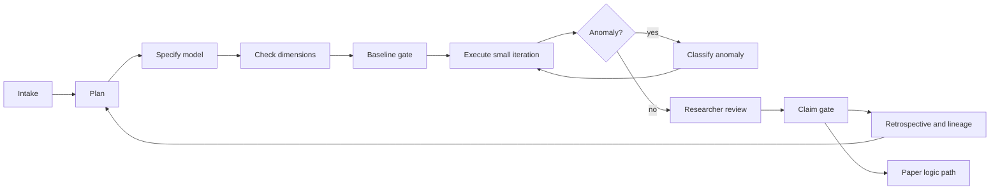
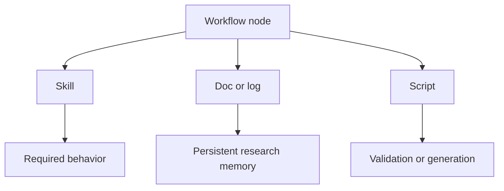
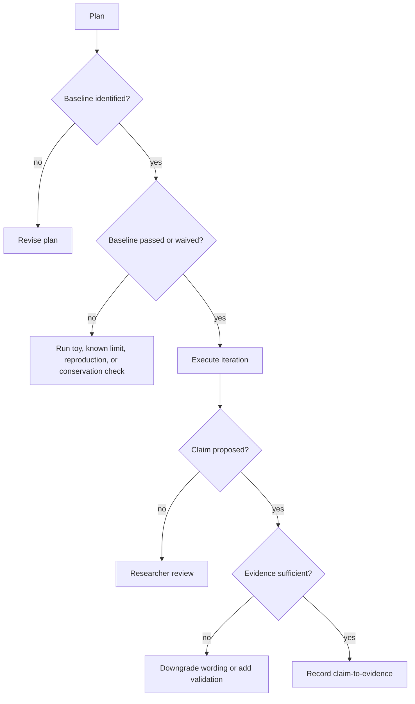

# Research Workflow Diagrams

## Research Workflow

```mermaid
flowchart LR
    A["Intake"] --> B["Plan"]
    B --> C["Specify model"]
    C --> D["Check dimensions"]
    D --> E["Baseline gate"]
    E --> F["Execute small iteration"]
    F --> G{"Anomaly?"}
    G -->|yes| H["Classify anomaly"]
    H --> F
    G -->|no| I["Researcher review"]
    I --> J["Claim gate"]
    J --> K["Retrospective and lineage"]
    K --> B
    J --> L["Paper logic path"]
```

## Responsibility Diagram

```mermaid
flowchart TB
    W["Workflow node"] --> S["Skill"]
    W --> D["Doc or log"]
    W --> C["Script"]
    S --> R["Required behavior"]
    D --> P["Persistent research memory"]
    C --> V["Validation or generation"]
```

## Gate Diagram

```mermaid
flowchart TD
    P["Plan"] --> B{"Baseline identified?"}
    B -->|no| BP["Revise plan"]
    B -->|yes| V{"Baseline passed or waived?"}
    V -->|no| BV["Run toy, known limit, reproduction, or conservation check"]
    V -->|yes| E["Execute iteration"]
    E --> C{"Claim proposed?"}
    C -->|no| R["Researcher review"]
    C -->|yes| G{"Evidence sufficient?"}
    G -->|no| DW["Downgrade wording or add validation"]
    G -->|yes| RC["Record claim-to-evidence"]
```
